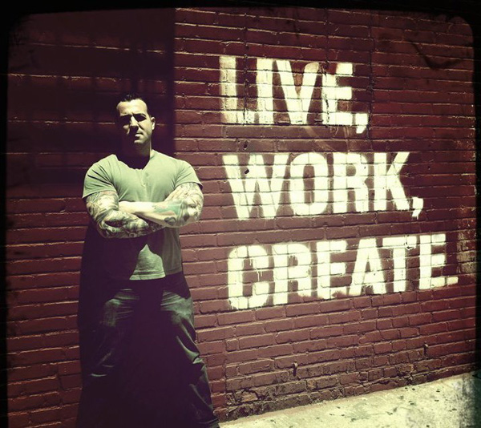
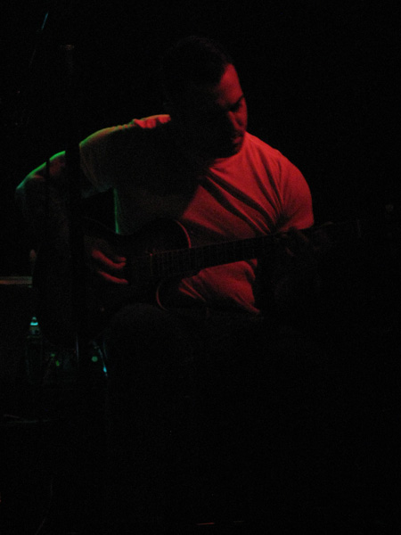
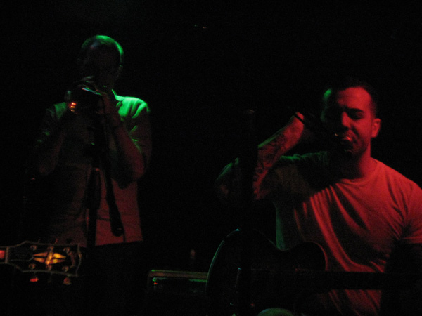

Interview by **O.S.**, August 2011

All images property of Jon DeRosa

_Jon DeRosa has been releasing music under various names for almost fifteen years, starting in his teenage years. He is best known for his project Aarktica, but is releasing [a new EP under his own name](http://www.eveningoflight.nl/2011/08/20/review-jon-derosa-anchored-ep-2011/ "Review: Jon DeRosa – Anchored EP (2011)") this month. We ask him about the background of his career, the inspiration for his music, and the future._

_To listen to a selection of Jon's music while reading the interview, we've prepared a [special retrospective Cloudscape](http://www.eveningoflight.nl/2011/09/10/cloudscape-aarktica-jon-derosa-spotlight/ "Cloudscape: Aarktica / Jon DeRosa Spotlight") that you can run in the background. Enjoy!_

**_OS: Can you tell me how your musical career got started? Dead Leaves Rising was your first project to be more widely released into the world, and put out two albums. How do you look back on those works and what other early projects were important to you?_**

JDR: I was in my early teens when I started recording under the name **Fade**. I released two cassettes, _Pale_, _Broken Truths_ in 1993 and _Windows_ in 1995. I look back on those releases…nostalgically. I was really quite naïve. Full of angst, cathartic, conflicted. I was thirteen years old.

I remember the actual writing and recording vividly and fondly. A lot of late nights, returning home from my summer job as a cook while the world slept, learning how to translate thoughts into music. I was just getting into bands on **4AD** and **Projekt** Records, and the Fade releases were my early interpretations of those kinds of sounds. I had been studying classical and flamenco guitar from age 10, so there is a lot of that influence as well.

This was in the pre-internet days, so everything was via physical mail and word of mouth (and zines). I think that, in itself, is the most striking thing when I think about the early days: the absence of the Internet for connecting with others. In a lot of ways, it made the connections that you did make all the more special. I have boxes of physical correspondence surrounding the early releases.

I sent the tapes around to labels, namely Projekt Records, where Pat Ogle was booking a lot of the label’s first tours. He gave me opening spots on Projekt shows in the East. I don’t think he had the slightest clue that I was only about 14 or 15 at the time. In the end, I opened for **Love Spirals Downwards**, **lovesliescrushing**, **Sean Bowley/Eden**, **Black Tape For A Blue Girl**, **Attrition**, (et al) all before I was 18 years old.

Brian John Mitchell at **Silber** Records has been talking about reissuing those Fade albums. I haven’t heard either of them in about 10 years.

Fade evolved into **Dead Leaves Rising** in 1996, and was followed by the release of the _Shadow Complex_ CD in 1997, which definitely presented a more aggressive and dark folk/goth sound. The second Dead Leaves Rising album _Waking Up On The Wrong Side Of No One_ wasn’t released for another four years, and leaned away from the gothic influences and toward a more indie rock/folk sound. _Shadow Complex_ is what I would consider my first “official” release.

Both Dead Leaves Rising albums were just released digitally through Silber Records this year, since they had been unavailable for quite some time. I think the early material is interesting in that it shows the most primitive origins of a sound that I would develop and change over the course of the next 15-20 years.

_What was it like growing up in the NY/NJ area, and how has it and its scene influenced you?_

I don’t think I ever followed any local “scenes,” really. Growing up in NJ, while most of my friends were listening to local hardcore, I was following Los Angeles goth or Bristol indiepop and **Sarah Records**, along with other stuff I considered truly “exotic.”

I gravitated to New York as a teenager because it seemed exciting, and I was really hungry to find other people who were into the same things I was into, musically. And it really has never disappointed in that sense. But, it’s a young person’s town. You need stamina. You need that youthful curiosity and optimism. I don’t know if it was like that in **Lou Reed**’s New York. But it feels that way to me now.

Sometimes I wonder if I would’ve gotten more music written if I lived in a smaller, quieter place and had fewer distractions in my life. But I don’t think it could’ve been any other way for me. And besides, I have met a lot of inspiring people, and had a lot of very unique experiences because of the city. I found that wasn’t the case for the stretches of time I lived in other places around the country and world.

_Nowadays you work in Williamsburg, Brooklyn, famous for being a multi-ethnic and constantly evolving artistic neighbourhood. What are your personal feelings about the place, and what role does it play in your music, apart from featuring in two Aarktica titles?_

I have some family roots here. My great-grandmother made bathtub gin in her apartment during Prohibition just a few minutes away from where I live now. My grandmother worked in a factory during the War, just one block away from where I sit. So, sometimes I look at it through those eyes…

Other times, I am always amazed by the “phenomenon” of Williamsburg and how it has become almost mythic on a world-scale. It’s Neverland for the masses! It’s a play within a play. There’s even a far-fetched sitcom I saw based here now.

There are some real, solid individuals I’ve met here, no doubt. But the place does make it awfully attractive to assholes these days. Is it a place for true men? Where young men can learn to be true men? I don’t think it is. And we need more true men. Just ask true women. But it’s also my home, you know?

But, I’ll step off the soapbox because my generation was the beginning of the problem. And while I have moral issues about the gradual disappearance of the middle class in New York City, I admittedly feel grateful as an observer to have lived in a dynamic neighborhood during its transformation. Socially it is really interesting how rapidly this place has changed since I moved here about 15 years ago.

_How did the idea to form Aarktica come to you when it first started?_

I don’t think it was a conscious decision, it was more of a coping mechanism to try and recreate sounds the way I heard them after experiencing sudden and permanent hearing loss in my right ear. I became somewhat of an insomniac due to the aural hallucinations and the electric shock sensations that occur when nerve damage occurs in the inner ear. So there were many nights spent in front of a 4-track tape recorder trying to make sense of what was happening to me.

It was really Brian at Silber Records that encouraged me to release the material. If not for him, I’m not sure I would’ve ended up pursuing it as a musical project.

_How would you describe the evolution of Aarktica from the beginning to now?_

There was a certain naïve curiosity, a sense of exploration and discovery in the beginning. And also, you know, an intimate turmoil within myself that marked the early recordings. But I have always been restless and tried to make each album different and varied, with the addition of instruments, players, song structures.

I consider the most recent release _In Sea_ a sequel to the first album _No Solace In Sleep_, and plan to continue in that realm of sound with Aarktica. I hope to have a new release ready in 2012.

_Is there a conscious stylistic division between the works you released for Darla Records and those on Silber Records?_

I don’t think I ever made conscious stylistic decisions based on what label was releasing the album. I think toward the end of my relationship with **Darla**, I attempted to make more pop-oriented music, because I felt that it would be interesting to update the sounds I’d established as “ambient,” and Darla encouraged that. Silber Records obviously champions more experimental sounds. But in the end, I always made the record I wanted to make.

_How important has your collaboration with these labels been for your music?_

Working with Darla Records was really not my best decision, at least beyond the _Bliss Out_ album. I just don't feel like we see eye to eye on a lot of important things, and that's important for an artist/label relationship.

On the other hand, Silber Records has consistently impressed me. Truly inspiring, original and ethical. It is a label with a vision that has truly always done its own thing and has always enabled the artist with the freedom to do what they want with his/her music.

_What is the most important thing you have learned in over 15 years of making music?_

**La Monte Young** said something to me during our studies together. I’m paraphrasing, but he said basically it is an artist’s responsibility to contribute to society. However, the way in which the artist contributes may not be the way in which he thinks he’s supposed to contribute. While I’m sure different people will interpret that in different ways, those words always stuck with me.

Another thing that I guess I have come to realize on my own is that success is relative. Everyone needs to find his/her own personal reason for making the music/art he/she makes. If you’re doing it for the wrong reasons, something will not feel “right” to you ever. If you are doing it for the right reasons and believe in what you are doing, you will always feel at peace with yourself. I would consider that the biggest success of all.

_Where did you find all the people to do those wonderful remixes of the 'In Sea' album?_

Believe it or not, most were artists who I had been in touch with for years and years. Artists to whom I listen, and whom have followed Aarktica over the years. I was truly humbled that so many talented friends were willing to devote their time and energy into reworking my songs. It’s a really great release. And great to finally work with folks like Jon from **Yellow6**, **Mason Jones**, Richard from **Hood/Declining Winter**…People who I’ve been in touch with for years but never met.

_The new EP released under your own name sees you returning to a more open sound, song-based, and perhaps back in the direction of what used to be Pale Horse and Rider. Do you plan on recording more in this style again under your own name or otherwise?_

\[caption id="attachment\_2219" align="alignright" width="150" caption="Anchored EP"\]\[/caption\]

I think the new album is actually really quite different than work I did with **Pale Horse and Rider**. But, in the sense that these are “songs” rather than “soundscapes,” I see what you mean.

Anchored is just the first of what will hopefully be many solo releases. After many years of making music under a guise, I really wanted to make an album that was musically representative of who I am today, which is something really difficult to do with a project like Aarktica that I have a 10 year history with.

_And who are you today?_

A working class singer/bartender still trying to best all my previous musical efforts.
