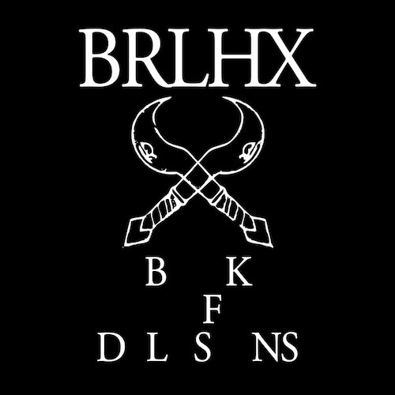

artist: **Burial Hex** release: _Book of Delusions_ format: LP year of release: 2011 label: Brave Mysteries duration: 32:24

**Burial Hex** has been accruing a reputation in the (post-)industrial underground for several years with a considerable amount of releases, but for some hadn't shown up on my radar in any significant way. This changed radically when I was presented with the two most recent releases from this project of **Clay Ruby**'s on **Brave Mysteries,** a publishing house that is rapidly becoming one of my favourites. The other release is the highly limited _Eschatology I_ tape, which is excellent in its own right, and which contains an extended mix of the title track on this LP, the main attraction.

The four tracks on this stellar album run the gamut from what has been aptly named horror ambient by some, to bombastic compositions of a unique kind, as well as marvellous ritual electronica. The two opening tracks exemplify the first style, combining deep drones, piercing high frequencies that set an eerie scene, samples, and growls from the deepest infernal pits. The parallels with horror soundtracks are perhaps tangible, but the music is far more than stage dressing. Throughout these tracks we clearly sense the sophistication of Clay Ruby's writing, with few repetitions and a flawless sense of flow.

"Crowned & Conquering Child" is a fascinating track, utterly uncompromising in its baroque layering of growls, howls, and wailing guitars over a simple piano melody and electronic pulse. Ever better are the choir vocals that truly take this harrowing track way out there.

If that wasn't enough, the whole B-side is taken up by the marvellous title track, a stunning piece of ritual electronics, with a solid beat as its central element. Vaguely marimba-like synths provide a bit of a bass layer, and the melodic lead role is for electric guitar, and one with a distinctly spacy feel to it. Again, this is a work so well-assembled that length becomes a non-issue. Different instruments, voices, and percussive elements join in on the track at various points, and it never ceases to hypnotise. You can get a particularly good impression of the evocative power of the track in this video, where it is coupled with a scene from Fellini's _Roma_:

\[vimeo 20775822\]

The LP isn't that long, but filled with excellent material by an artist that keeps pushing boundaries in modern underground music. Like many of his label kindred, Burial Hex has a unique vision and the daring to put it forth without compromise, and in this case, that all turns out brilliantly. This is certainly no music for the faint of heart, but will delight lovers of the esoteric, obscure, and intense.

Reviewed by **O.S.**

Tracklist:

1\. Final Litany (4:17) 2. Urlicht (4:59) 3. Crowned & Conquering Child (8:10)

4\. The Book of Delusions (14:58)
