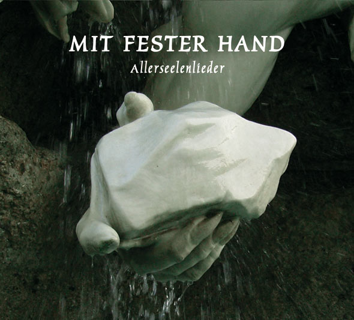

artist: **Various Artists** release: _Mit Fester Hand - Allerseelenlieder_ format: CD year of release: 2011 label: [Ahnstern](http://www.steinklang.at/shop/) duration: 88:19

detailed info: [discogs.com](http://www.discogs.com/Various-Mit-Fester-Hand-Allerseelenlieder/release/2937319)

A compilation dedicated to the long-standing Austrian industrial project **A**ll**erseelen** is a very understandable thing, after over twenty years of activity in the European underground. Drawing mostly from the rich roster of **Steinklang**/**Ahnstern** label artists, _Mit Fester Hand_ presents an interesting overview of Allerseelen work in varying interpretations, though mostly within the neofolk corner.

An individual treatment of all tracks on this compilation would be a bit too much, in my opinion, but there are certainly quite a few tracks worth mentioning on the CD. Not everything is very exciting, and the compilation has a rather unassuming take-off with a few average tracks, but the overall sound is constant and pleasant to listen to. In my opinion, things start to take off properly with the organ-heavy version of  "Flamme" by **Die Weisse Rose**. The **Blood Axis** & **Sangre Cavallum** version of "Sonne Golthi-Ade" is also very nice, particularly because of the organic folk sound, and the typical mediterranean instrumentation we can hear on other Sangre Cavallum work. **Larrnakh** provide an atmospheric point of rest in the album with a great mixture of ambient and folk styles. **Àrnica** in their turn impress me with a very stripped down folk style that feels very ritual and intimate. One of my favourite tracks must be the surprising "Flama" by **Der Arbeiter**, a very well-flowing flamenco-inspired track. Also interesting - both kitschy and catchy - is the bombastic electro of **Der Feuerkreiner** on "Feuersalamander". The **Svarrogh** version of "Heiliges Blut" deserves mention too, not in the least because of its playful nod towards **NON**'s "Total War". Closing off the album is obviously the title track in its **Allerseelen** version, a powerful track with beat and martial samples, dedicated to a radical self-transformation. A pity that the **Von Thronstahl** version of this track wasn't included as well (released last year by **Cold Spring** on the _Conscriptum_ compilation) as it too provides a powerful version of this song.

Though not everything on _Mit Fester Hand_ is pure gold, I'd say it is a very honourable tribute to **Allerseelen** and an important part of any collection of that band's works, as well as an interesting release to check out for anyone in the European industrial/neofolk area.

Reviewed by **O.S.**

Tracklist:

1 **Ernte** – Santa Sangre (Jodorowsky Mix) (2:10) 2 **Tyr-Kreis** – Ernting (3:34) 3 **Haberfeld** – Olle Lust Wui Ewigkeit (4:53) 4 **Die Weisse Rose** – Flamme (3:52) 5 **Fanes** – Sonne Golthi-Ade (4:14) 6 **Sagittarius** – Musa (4:31) 7 **Scivias** – Idun (4:04) 8 **Fräkmündt** – Firnföuskamerad (4:08) 9 **Hrefnesholt** – Herbstlied (5:34) 10 **Ô Paradis** – Marqués De Púbol (4:45) 11 **Blood Axis** & **Sangre Cavallum** – Sonne Golthi-Ade (3:51) 12 **Sturmpercht** – Sturmlied (5:24) 13 **Larrnakh** – Knistern (4:30) 14 **Àrnica** – Foc De Salamandra (5:11) 15 **Klammheim** – Allerseelen (5:23) 16 **Der Arbeiter** – Flama (4:53) 17 **Der Feuerkreiner** – Feuersalamander (5:05) 18 **Cawatana** – Alle Lust Will Ewigkeit (3:57) 19 **Svarrogh** – Heiliges Blut (4:40) 20 **Allerseelen** – Mit Fester Hand (3:40)
