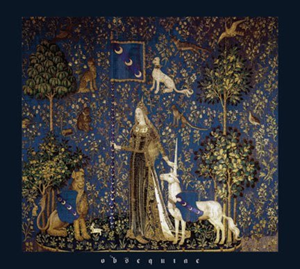

artist: **Obsequiae  
**release: _Suspended in the Brume of Eos  
_format: CD  
year of release: 2011  
label: [Bindrune](http://bindrunerecordings.com/)  
duration: 41:37

detailed info: [discogs.com](http://www.discogs.com/Obsequiae-Suspended-In-The-Brume-Of-Eos/release/3065682)

The US duo **Obsequiae** is a continuation of the earlier project **Autumnal Winds**, and with _Suspended in the Brume of Eos_ (that last bit means fog of dawn, in case you were wondering like me) they present their first large release, after earlier demos. While the band has its roots in melodic death/black metal, which is still the most prominent sound on this album, there is no doubt that this record carries a strong influence of mediaeval and early music.

Now, mediaeval is often a troubling influence in popular music. All too often the elements that have to lend something a mediaeval tinge are renaissance faire costumes, Olde English, and even a certain amount of drollness. In metal, things are hardly better, where these influences are generally limited to posing with swords and - dare I say it - lots of keyboards. At first glance, **Obsequiae** ticks a few similar boxes, with gloomy castle pictures on the inside of the CD, mediaeval European pseudonyms, and the lovely [Lady and the Unicorn](http://en.wikipedia.org/wiki/The_Lady_and_the_Unicorn) tapestry that graces the front cover.

However, on _Suspended in the Brume of Eos_ the influence is more than skin deep, and that makes this album so powerful. Besides a selection of popular mediaeval interludes played on acoustic guitar that balance against the eight mostly high-speed metal tracks, we can clearly hear the influence of mediaeval melody and tone even in the latter, where the often dual lead guitars hammer out one brilliant line after another. Perhaps many metal musicians have often wondered how certain mediaeval tunes would sound played as metal, but I have exactly the reverse sensation with many of the tracks on this album. From the gently rippling lead from the title track to the slower majesty of "The Wounded Fox", and many other bits in the album, it's crystal clear that **Obsequiae**'s music manages to be both: quick, technical and energetic extreme metal that is obviously from this day and age, but with resonances of ages past. Rather than just implying or even faking mediaeval influence through external means, this band was truly inspired _musically_ by mediaeval forebears, even serving as a sort of missing link between then and now.

Apart from the general success of this approach, I simply have to mention the marvellous opening track, the relentless waltz of "Altars of Moss". This track is pure gold from the start to its glorious finish with one of the best riffs I've ever heard. More general praise goes to the tight rhythm section, and the production, as this is one of those albums that proves that a good bass guitar sound is a valuable asset to a metal album.

This one of those metal albums that sound conventional on the surface but harbour a vast amount of sophistication within. If there's any band that deserves the label 'mediaeval metal' (or as the promo notes have it, 'castle metal'), **Obsequiae** is it. If these guys could serve up another portion of this the coming years, I'd be much obliged.

Reviewed by **O.S.**

Tracklist:

1\. Altars Of Moss (5:23)  
2\. Sidhe (2:21)  
3\. In The White Fields (4:10)  
4\. Suspended In The Brume Of Eos (5:43)  
5\. Wildes Heer (1:07)  
6\. The Wounded Fox (4:56)  
7\. Atonement (2:17)  
8\. Estas Redit (1:03)  
9\. Arrows (2:59)  
10\. The Starlit Shore (5:31)  
11\. Boreas (2:18)  
12\. Cabin Lights (3:51)
