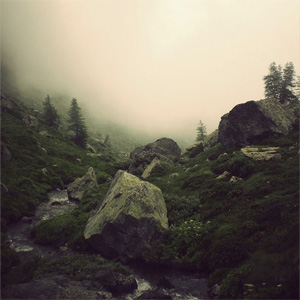

[Cloudscape #19: October 2011](http://www.mixcloud.com/eveningoflight/cloudscape-19-october-2011/?utm_source=widget&utm_medium=web&utm_campaign=base_links&utm_term=resource_link) by [Evening Of Light](http://www.mixcloud.com/eveningoflight/?utm_source=widget&utm_medium=web&utm_campaign=base_links&utm_term=profile_link) on [Mixcloud](http://www.mixcloud.com/?utm_source=widget&utm_medium=web&utm_campaign=base_links&utm_term=homepage_link)

00:00 | Rain Drinkers | Springtide | Springtide | 2011 08:11 | Sand Snowman | The Memory Box | [The Magpie House](http://www.eveningoflight.nl/2009/02/01/review-sand-snowman-two-way-mirror-2009/ "Review: Sand Snowman – Two Way Mirror (2009)") | 2009 14:32 | Rose Croix | II | [Rose Croix](http://www.eveningoflight.nl/2011/12/14/review-rose-croix-2011/ "Review: Rose Croix (2011)") | 2011 17:30 | Somnivore | It Is Told (A Common Funeral) | Golden Blood | 2008 18:54 | Joonatan Elokuu & Mossycoat | Owlsong | Joonatan Elokuu & Mossycoat | 2011 25:46 | The Great Park | Make a Dead One of It | Now Wash Your Hands | 2011 29:59 | Haiku Funeral | City in the Sea | [If God Is a Drug](http://www.eveningoflight.nl/2011/10/31/october-2011-short-reviews/ "October 2011 Short Reviews") | 2010 33:58 | Aidan Baker & thisquietarmy | Blood | Orange | 2011 38:01 | Thorn1 | spiral stars in the sky on Jan. 11, 2009 and May 21, 2007, but I promised to return | Oblivion EP | 2011 44:55 | Momick | V | [Momick](http://www.eveningoflight.nl/2011/10/20/review-momick-2011/ "Review: Momick (2011)") | 2011 49:52 | Higuma | Pacific Temple | [Pacific Fog Dreams](http://www.eveningoflight.nl/2011/11/14/review-higuma-pacific-fog-dreams-2011/ "Review: Higuma – Pacific Fog Dreams (2011)") | 2011 57:43 | Bohren & der Club of Gore | Von Schnäbeln | [Dolores](http://www.eveningoflight.nl/2008/12/01/review-bohren-der-club-of-gore-dolores-2008/ "Review: Bohren & Der Club of Gore – Dolores (2008)") | 2008 61:31 | David Sylvian | Brilliant Trees | Brilliant Trees | 1984
