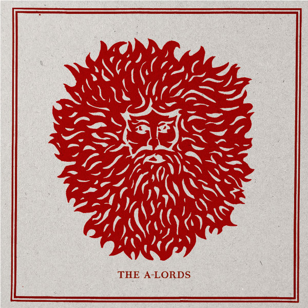

artist: **The A. Lords** release: _The A. Lords_ format: LP year of release: 2011 label: [Rif Mountain](http://www.rifmountain.com/) duration: 37:53

detailed info: [discogs.com](http://www.discogs.com/A-Lords-The-The-A-Lords/release/3165895)

Recorded over then summers between 2000 and 2010, this eponymous LP is the definitive work (so far?) by **The A. Lords**, the duo consisting of **Michael Tanner** and **Nicholas Palmer**. A lovely [five-track EP](http://www.eveningoflight.nl/2008/02/01/review-the-a-lords-2006/ "Review: The A. Lords (2006)") already appeared in 2006 on the now defunct **Barl Fire** imprint, and four tracks off that release also made it to this LP, some with new names. Six new tracks have been added to fill out the album with more wonderful pastoral folk meanderings.

My verdict from five years ago still stands: this is gorgeous music that practically breathes the outdoors, the sunshine, and the Dorset landscape in which it was recorded. A wide variety of acoustic instruments gives each track on the album a unique palette, with many opting for sweet drifting melodies accented with staccato glockenspiel or dulcimer notes, besides the more familiar guitar sound, but also gentle organ drones, bells, toy piano, and the ever-present natural background sounds.

This LP is a compact album with a clear musical vision, and a perfect companion to  a day in the sun, whether it's in summer, or a day like we're having now: a crisp and clear October morning where the sun's warmth is all the more welcome. Calm freefolk at its best, in other words. The lovely vinyl edition by **Rif Mountain** with its stunning stylised artwork only adds to the appeal. Limited to 250 copies, so off ye go!

Reviewed by **O.S.**

Tracklist:

1\. Freohyll (2:58) 2. Mistress Chetell (5:27) 3. Summerhouse (5:16) 4. Crimson Rambler (2:23) 5. Of Wren Or Raven (3:48)

6\. Skyclad In Pendle (6:27) 7. The Seventh Child (2:07) 8. Hopkin's Lament (3:12) 9. Things Near And Far (3:23) 10. Pyewacket's Nest (2:52)
