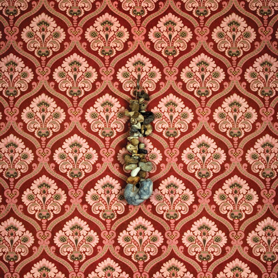

artist: **Momick** release: _Momick_ format: LP year of release: 2011 label: [Bladud Flies!](http://bladudflies.com/) duration: 36:58

detailed info: [discogs.com](http://www.discogs.com/Momick-Momick/release/3092560)

**Momick** is a new project by **Richard Moult** and **the bricoleur** (**Michael Lawrence**) where they elaborate upon the mix of piano and electronic manipulation that we first heard on some tracks of Moult's _[Ethe](http://www.eveningoflight.nl/2010/03/09/review-richard-moult-ethe-2010/ "Review: Richard Moult – Ethe (2010)")_ album. This style draws upon an exaggeration of the reverberating and drifting qualities of the piano sound, which brings the music somewhere in between classical and ambient.

The melodic tone of _Momick_ is often melancholy or oppressive, and far less bright and folky than the otherwise lovely LP cover suggests. The intensity of the effects overlaying the piano sound wavers, resulting in a nice tension between crisper parts and other moments when the sound is a thick, massive wash, with even an outburst of noise at one point.

Variation between movements is considerable, particularly with the addition of some guest appearances here and there, to wit the lovely oboe of **Mark Baigent** in the fourth track, and the singular voice of **David Tibet** in a particularly emotional performance on the fifth. Of particular note too is the sixth movement, with its delightful piano swells that form a melody - or rather, a torrent of chords - that is slightly more uplifting than the rest of the album. The long final piece ends the album as it began, with a more mournful cadence.

_Momick_ is obviously a recommended album if you enjoyed any of Moult's earlier piano works, particularly _Ethe_, which featured experiments in this more ambient/electronic direction. For that reason, the album might also appeal to a more general ambient audience who are open to some interstitial dark piano sounds.

Reviewed by **O.S.**

Tracklist:

1\. 3:46 2. 4:57 3. 6:17 4. 2:20

5\. 5:43 6. 3:35 7. 10:20
