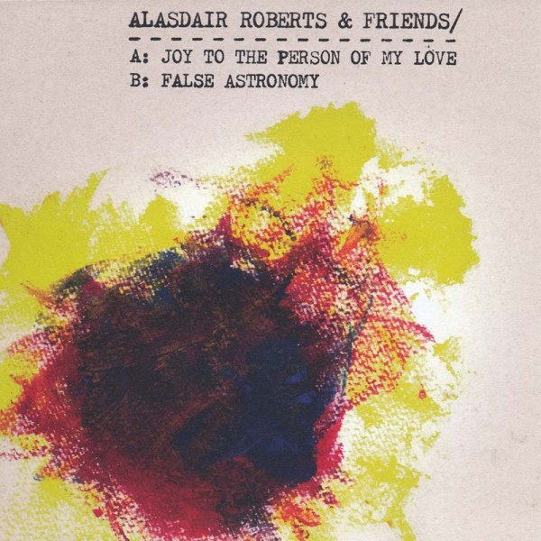
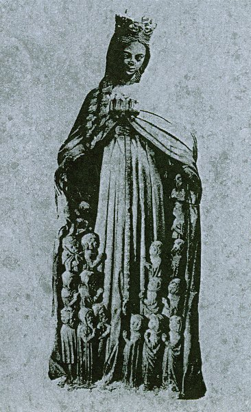
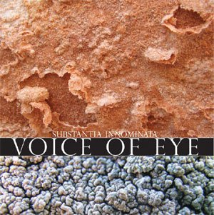

**Alasdair Roberts & Friends** - _Joy to the Person of My Love_ \[[discogs](http://www.discogs.com/Alasdair-Roberts-Friends-Joy-To-The-Person-Of-My-Love/release/2785641)\]

\[caption id="attachment\_2464" align="alignright" width="150" caption="Joy to the Person of My Love"\]\[/caption\]

This **Rif Mountain** 7" contains a duo of interpretations of 17th century songs. Scottish songster Roberts has made settings of these tunes for voice, acoustic guitar, flute, and whistle, which form a nice bridge between the sounds of the renaissance and of modern folk stylings.

I'm particularly fond of the B-side "False Astronomy", which has a typical melody which reminds me a bit of older Christmas carols. Probably not that strange if I am correct in my assumption that those originate in the same period. Regardless, Roberts' deliverance of the poetry is exceptionally strong rhythmically and results in a rather feelgood track.

This is a short but sweet single that is sure to please folk lovers with a penchant for renaissance music.

**Burial Hex -** _Eschatology I_ \[[discogs](http://www.discogs.com/Burial-Hex-Eschatology-I/release/2867344)\]

\[caption id="attachment\_2476" align="alignright" width="92" caption="Eschatology I"\]\[/caption\]

**Clay Ruby**'s Burial Hex project is generally a more than excellent source of music skirting the edges of drone, ritual, ambient, and dark occult moods, and this tape on his own label **Brave Mysteries** is no exception.

The 60-minute effort focuses on two long compositions. The first is "Twilight Visitors", a piece which flows back and forth between raw pulsating drones and softer ambient synths, with a good balance between intensity and silence. Other elements include various warped voices, as well as multiple different modified synth sounds, resulting in a long ambient piece that rewards attentive listening now and again. You'll discover something different each time.

The B-side contains a long mix of the stellar track "Book of Delusions", which I'd already praised in my review of the [album bearing the same title](http://www.eveningoflight.nl/2011/09/21/review-burial-hex-book-of-delusions-2011/ "Review: Burial Hex – Book of Delusions (2011)"). This version is twice as long, but the beat is so hypnotising and the arrangement flows so seamlessly that these 30 minutes drift by before you know it. Marvellous work!

**Haiku Funeral** - _If God Is a Drug_ \[[discogs](http://www.discogs.com/Haiku-Funeral-If-God-Is-A-Drug/release/2567564)\]

\[caption id="attachment\_2471" align="alignright" width="132" caption="If God Is a Drug"\]\[/caption\]

Haiku Funeral is a project operating on the crossroads of industrial, electro, dark/doom metal, noise, and ambient, and this third album of theirs is as diverse and hard to pigeonhole as that might suggest. The album lacks little in ambience, with themes of disease, drugs, darkness, and madness springing to mind quite clearly.

The musical diversity is both a blessing and a curse on _If God Is a Drug_. While the album is highly varied and not a boring listen, it seems to lack a sense of direction and coherence to some degree. Nevertheless, there are quite a few interesting tracks on this album, and they'll probably be different for each listener. I'm particularly fond of the electro/industrial on "The Holy Connection", and the Lovecraftian spoken word / dark ambient of "City in the Sea". Other nice elements include oriental melodies on bass, the eerie female spoken word on "Bright Red Seeds", to name a few.

An interesting album if you're looking for something different and not afraid to cross genre boundaries multiple times over the course of one album.

 

**Voice of Eye** - _Substantia Innominata_ \[[discogs](http://www.discogs.com/Voice-Of-Eye-Substantia-Innominata/release/1657258)\]

\[caption id="attachment\_2468" align="alignright" width="150" caption="Substantia Innominata"\]\[/caption\]

Voice of Eye is another one of those dark ambient projects that have passed under my radar for too long. This 10" on the sublime _Substantia Innominata_ series by **Drone Records** is only one of the more recent records in a career that spans two decades. Despite being smaller than an LP, this three-track effort clocks in at almost 38 minutes, half of it being taken up by the long first track on side A, "Vīrya", a Sanskrit word roughly meaning 'virile'. Despite its length and minimalism, the track impresses with its dominant otherworldly voices, which are compelling and ever-changing. Only near the end of the track do we hear a few other sounds from the dark ambient arsenal, a combination which continues over on the first track of side B, named "Dhyāna", meaning meditation - 'zen' is the equivalent term in Japanese. The track slowly tapers out into soft, intermittent synth waves, maintaining the mystic, ambiguous atmosphere. The final track, "Puruşa" ('the self') is particularly beautiful, featuring a softer, gentler melody of synth waves, joined in the end by lovely drifting flute tones, slightly reminiscent of **Tangerine Dream**'s classic "Sequent 'C'".

All in all this is a wonderful album, deceptively beautiful and compelling despite its apparent minimalism and limited spectrum of sounds. The physical manifestation is also great, as are all _Substantia Innominata_ releases, but the artwork and vinyl (clear with warm golden streaks) are particularly beautiful on this one. Recommended for all dark ambient aficionados!
