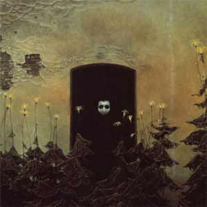

[Cloudscape #20: November 2011](http://www.mixcloud.com/eveningoflight/cloudscape-20-november-2011/?utm_source=widget&utm_medium=web&utm_campaign=base_links&utm_term=resource_link) by [Evening Of Light](http://www.mixcloud.com/eveningoflight/?utm_source=widget&utm_medium=web&utm_campaign=base_links&utm_term=profile_link) on [Mixcloud](http://www.mixcloud.com/?utm_source=widget&utm_medium=web&utm_campaign=base_links&utm_term=homepage_link)

00:00 | Tenhi | Saivon Kimallus | [Saivo](http://www.eveningoflight.nl/2011/12/28/review-tenhi-saivo-2011/ "Review: Tenhi – Saivo (2011)") | 2011 03:20 | Sand Snowman | Regal Season | [The World's Not Worth It](http://www.eveningoflight.nl/2011/11/21/review-sand-snowman-the-worlds-not-worth-it-2011/ "Review: Sand Snowman – The World’s Not Worth It (2011)") | 2011 07:40 | Vortex | Fatalism | Rockdrill | 2011 11:34 | Momick | Momick VI | [Momick](http://www.eveningoflight.nl/2011/10/20/review-momick-2011/ "Review: Momick (2011)") | 2011 13:44 | Oxblood Reincarnations | Seabirds | Split but for the Roots | 2005 20:00 | Tenhi | Tuuli Varista | [Folk Aesthetic 1996-2006](http://www.eveningoflight.nl/2008/01/01/review-tenhi-folk-aesthetic-1996-2006-2007/ "Review: Tenhi – Folk Aesthetic 1996-2006 (2007)") | 2007 27:18 | Far Black Furlong | Winter Flowers, Caerbre | [Caerbre](http://www.eveningoflight.nl/2009/06/03/review-far-black-furlong-caerbre-2009/ "Review: Far Black Furlong – Caerbre (2009)") | 2009 36:11 | Giacinto Scelsi | Anâgâmin | Natura Renovatur | 2006 42:54 | Laibach | Nova Akropola | Nova Akropola | 1986 49:15 | Vox Populi! | Doumai v3 | Mystic Entertainment | 2009 50:37 | Alphane Moon | Reap a Field of Light | The Echoing Grove | 1999 55:19 | Akhet | Akhet IV | Akhet | 2011 63:37 | Voice of Eye | Puruşa | [Substantia Innominata](http://www.eveningoflight.nl/2011/10/31/october-2011-short-reviews/ "October 2011 Short Reviews") | 2009 71:56 | Tenhi | Siniset Runot | Saivo | 2011
