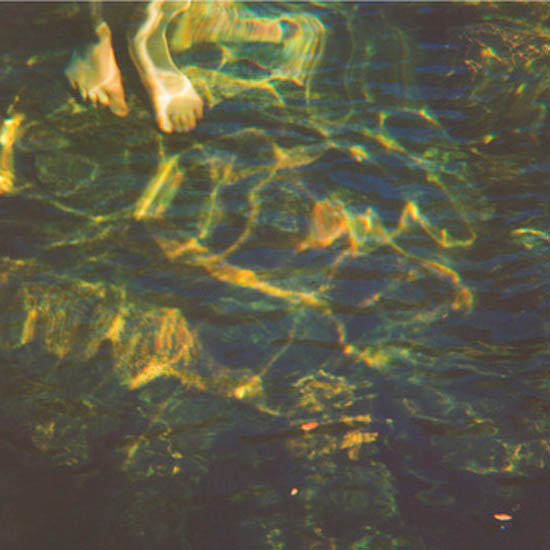

artist: **Higuma** release: _Pacific Fog Dreams_ format: LP year of release: 2011 label: [Root Strata](http://rootstrata.com/) duration: 40:58

detailed info: [discogs.com](http://www.discogs.com/Higuma-Pacific-Fog-Dreams/release/2763474)

This project of **Evan Caminiti** (also of **Barn Owl**) and **Lisa McGee** has released one earlier album and one EP, but ultimately got my attention this year with this, the _Pacific Fog Dreams_ LP. From a project related to Barn Owl, one would expect dreamy, psychedelic music, and that assumption is warranted, although **Higuma** focuses exclusively on lush guitar and vocal drones.

A minimalism in approach yields a maximum of impact on _Pacific Fog Dreams,_ where relatively simple tonal and chord progressions are transformed into fuzzy blankets of sound by a variety of effects. In other words, it is an exercise in utilising sound manipulation to create precisely the textures and timbres wanted to create evocative and atmospheric music.

The power of the music is therefore not only in the grand sweep of the sound, but also in the little details that strike you here and there. A small turn of voice or note can have a lot of power when it successfully articulates itself out of a dense wash of fuzz. Particularly the melancholy first track has quite of few of those gripping moments, and the acoustic outro on "Crystal Harvest" is another divine moment, perhaps rather unassuming in any other context, but perfect here.

_Pacific Fog Dreams_ is an excellent LP for lovers of thick drones with a touch of the organic, the spacious, the aqueous. A moment of drifting and contemplation that's simple enough to be accessible, yet deep enough to hold you for quite a while.

Reviewed by **O.S.**

Tracklist:

1\. Pacific Temple (8:18) 2. Burning Colors (3:59) 3. Morraine (6:13)

4\. Crystal Harvest (4:37) 5. White Winds (3:25) 6. Solstice (6:01) 7. The Veiled Lamp (8:25)
