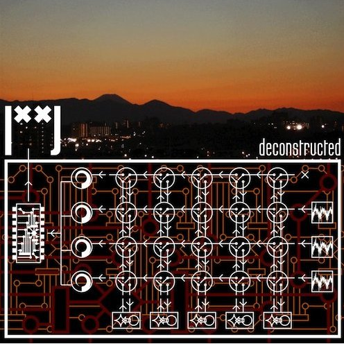

artist: **|˟˟|** release: _Deconstructed_ format: CD year of release: 2011 label: [Fluttery](http://www.flutteryrecords.com/) duration: 71:08

detailed info: [discogs.com](http://www.discogs.com/Gate--Deconstructed/release/2958462)

**Lajos Ishibashi-Brons**' project **|˟˟|** is back again this year, but with a new approach. Where his first [three albums](http://www.eveningoflight.nl/2010/11/17/retrospective-%cb%9f%cb%9f-gate-three-releases/ "Retrospective: |˟˟| (Gate) – Three Releases") featured an eclectic mix of rock, industrial noise, and free jazz that was above all improvised, his latest album _Deconstructed_ focuses instead on remixes/deconstructions of recordings from the sessions of the album _Iterations._

While sitting down and treating improvised recordings to an overhaul entails the risk of losing a sense of spontaneity, the resulting tracks on this album are certainly not complacent and overpolished affairs. If anything, a good many of the tracks offer even more layering and sounds from many different directions than what we heard on the previous album.

Some tracks, such as the fourth, "75R", are a bit more laid back, resting on a constant drone and with subdued woodwind improvisations on top. Others, however, dive deep into chaotic and dense compositions, with screechy loops, guitar and woodwind melodies nearly climaxing into cacophony. Overall, there is a pleasant balance between these extremes, and in this way the album combines tendencies that were heard separately on earlier albums, as well as adding a few textures that are only achieved with later editing and mixing.

As such, _Deconstructed_ has a lot to offer to those who enjoyed any or all of **|˟˟|**'s earlier releases, but if you're a newcomer interested in highly experimental sounds on the borders of jazz and extreme offshoots of rock and industrial, this album is recommended just the same.

Reviewed by **O.S.**

Tracklist:

1\. 81U.R (6:30) 2. 55R (4:58) 3. 58R (6:24) 4. 75R (8:17) 5. 56R (10:00) 6. 67R (7:43) 7. 72R (5:10) 8. 65R (3:34) 9. 30 Seconds Of Silence (0:30) 10. 57R (18:02)
