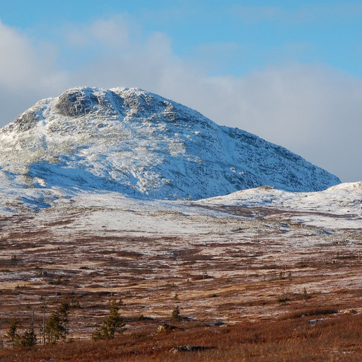

[Cloudscape #21: December 2011](http://www.mixcloud.com/eveningoflight/cloudscape-21-december-2011/?utm_source=widget&utm_medium=web&utm_campaign=base_links&utm_term=resource_link) by [Evening Of Light](http://www.mixcloud.com/eveningoflight/?utm_source=widget&utm_medium=web&utm_campaign=base_links&utm_term=profile_link) on [Mixcloud](http://www.mixcloud.com/?utm_source=widget&utm_medium=web&utm_campaign=base_links&utm_term=homepage_link)

00:00 | The A. Lords | Freohyll | [The A. Lords](http://www.eveningoflight.nl/2011/10/16/review-the-a-lords-2011/ "Review: The A. Lords (2011)") | 2011 02:30 | Wolfert Brederode Quartet | Common Fields | Currents | 2007 09:20 | Zvuku | Cold | SEQUENCE2 | 2011 17:55 | Sand Snowman | Events in a Skyline | [The World's Not Worth It](http://www.eveningoflight.nl/2011/11/21/review-sand-snowman-the-worlds-not-worth-it-2011/ "Review: Sand Snowman – The World’s Not Worth It (2011)") | 2011 23:45 | Kate Bush | Lake Tahoe | 50 Words for Snow | 2011 34:38 | Tenhi | Paluu Joelle | [Saivo](http://www.eveningoflight.nl/2011/12/28/review-tenhi-saivo-2011/ "Review: Tenhi – Saivo (2011)") | 2011 39:37 | This Immortal Coil | Red Queen | The Dark Age of Love | 2009 47:14 | Akira Rabelais | (Gorgeous Curves Lovely Fragments Labyrinthed On Occasions Entwined Charms, A Few Stories At Any Longer Sworn To Gathered From A Guileless Angel And The Hilt Edges Of Old Hearts, If They Do In The Guilt Of Deep Despondency.)  | Spellewauerynsherde | 2004 48:34 | Northaunt | Night Alone | Horizons | 2006 51:44 | In-Existence | Ritual Reprise | Private Rituals | 1998 57:10 | Twelve Thousand Days | Glistening Praise | The Devil in the Grain | 2001 60:33 | Richard Moult | Part 2 | [Celestial King for a Year](http://www.eveningoflight.nl/2011/08/05/review-richard-moult-celestial-king-for-a-year-2011/ "Review: Richard Moult – Celestial King for a Year (2011)") | 2011 64:26 | Raison d'Être | disintegrates from within, | Requiem for Abandoned Souls | 2003 73:35 | Estampie | Al Jorn - Triana | Signum | 2004
