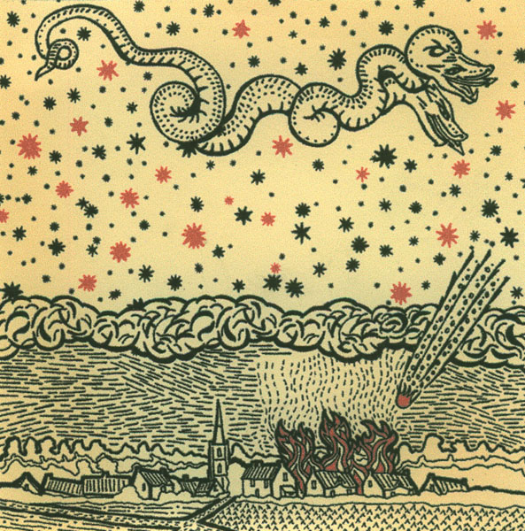

\[caption id="attachment\_2585" align="alignright" width="149" caption="7" cover"\]\[/caption\]

artist: **The Straw Bear Band** release: _Vexed Soul EP_ format: 7" + 3" CD-R year of release: 2010 label: [Rif Mountain](http://rifmountain.com/) / [Hobby Horse](http://www.midwich-cuckoos.co.uk/) duration: 17:23

detailed info: discogs.com \[[1](http://www.discogs.com/Straw-Bear-Band-Vexed-Soul-EP/release/2657854), [2](http://www.discogs.com/Straw-Bear-Band-Vexed-Soul-EP/release/2657896)\]

This co-release from the English label family linked to **The Owl Service** features a very nice and short selection of tracks by **The Straw Bear Band** (**Dominic Cooper**). It consists of a 7" vinyl single, supplemented with a few additional tracks on a 3" CD-R.

"A Lyke Wake Dirge" and "Nottamun Town" are both British folk classics, given an original and pleasant interpretation. The first track hobbles on at a brisk pace, utilising that unmistakable horseback rhythm in the percussion. At first it jarred me a little, such a driving rhythm behind lyrics that are so contemplative, but musically, it works very well, making it quite the catchy track. A similar though calmer rhythmic power is behind "Nottamun Town", which has more of a swing to it.

\[caption id="attachment\_2586" align="alignleft" width="148" caption="3" cover"\]\[/caption\]

The tracks on the 3" are less percussive in nature, focusing more on **Jason Steel**'s guitar and Dom Cooper's voice. Both "Black Candy" and "Go Dig My Grave" are solid own compositions where the power of the minimal folk setup shines forth quite well. The final track is particularly special though, as "Dead Souls" is a cover of the **Joy Division** track. However, the melancholic rendition we find here is a wholly different take on the original, and in my opinion at least as worthy as a song. Quite beautiful!

This EP in double format is short but rich in content, and certainly a recommended title if you are already familiar with the music coming from this group of labels and artists, but also if you are interested in alternative British folk generally.

Reviewed by **O.S.**

Tracklist:

1\. A Lyke Wake Dirge (4:29)

2\. Nottamun Town (4:31)

3\. Black Candy (3:12) 4. Go Dig My Grave (1:45) 5. Dead Souls (3:26)
