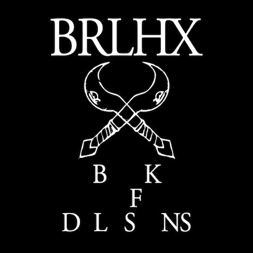
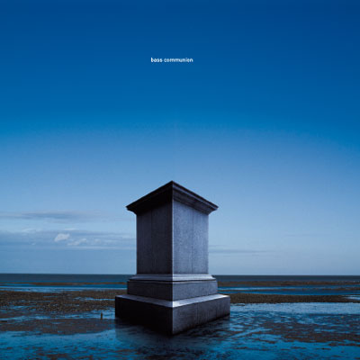
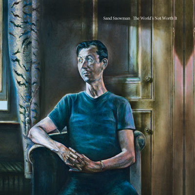
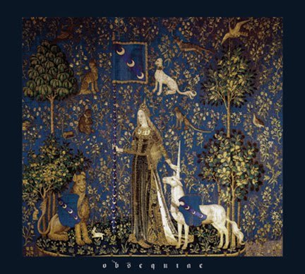
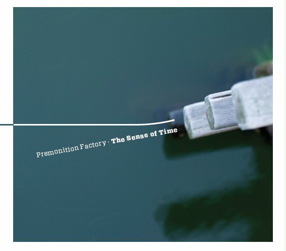
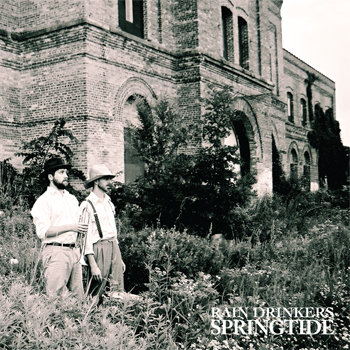
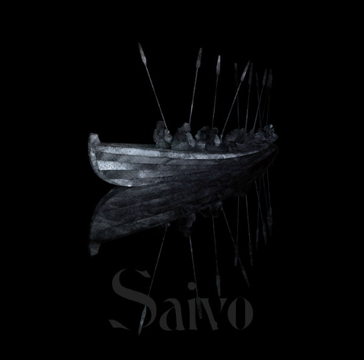

We're joining in the list fever this year - though not before the year is more or less through - with the favourite 2011 records from Evening of Light HQ. Of course we missed tons of good releases out there, but these at least are things we particularly enjoyed. Thanks to all the artists and labels for sharing their music with us.

First the top 10, in alphabetical order.

**The A. Lords** - _The A. Lords_ (Rif Mountain) \[[Our Review](http://www.eveningoflight.nl/2011/10/16/review-the-a-lords-2011/ "Review: The A. Lords (2011)")\]

The LP followup to 2006's self-titled 3" is a masterpiece of pastoral, almost ambient, folk. **Nicholas Palmer** and **Michael Tanner**'s blend of many acoustic instruments with field recordings, and quite a few fortuitous guest appearances, makes for a wonderful album that started out as a relaxed summer favourite and turned into a classic for all seasons.

~

**Bass Communion** - _Cenotaph_ (Tonefloat)

**Steven Wilson**'s drone project hits bullseye with this CD/LP release on **tonefloat**. The four massive tracks on this album combine ultra-deep drones with pulsating beats in a flawless production. One of the most hypnotic releases of the year!

~

**Burial Hex** - _Book of Delusions_ (Brave Mysteries) \[[Our Review](http://www.eveningoflight.nl/2011/09/21/review-burial-hex-book-of-delusions-2011/ "Review: Burial Hex – Book of Delusions (2011)")\]

Aural insanity is one way to describe the utterly original and uncompromising output of **Burial Hex** the past few years. It appears the project is ending after this year, but _Book of Delusions_ is one of the testaments to its genius, combining drones, samples, organ, piano, demented screams, and hypnotic beats into an unholy musical mixture.

~

**Momick** - _Momick_ (Bladud Flies!) \[[Our Review](http://www.eveningoflight.nl/2011/10/20/review-momick-2011/ "Review: Momick (2011)")\]

**Richard Moult** and **Michael Lawrence** bring their lysergic piano morphing to a debut full length filled with melancholic melodies and soundscapes, including beautiful guest performances by **David Tibet** on vocals and **Mark Baigent** on oboe.

~

**Obsequiae** - _Suspended in the Brume of Eos_ (Bindrune) \[[Our Review](http://www.eveningoflight.nl/2011/09/26/review-obsequiae-suspended-in-the-brume-of-eos-2011/ "Review: Obsequiae – Suspended in the Brume of Eos (2011)")\]

This duo's excellent blend of death/black metal and mediaeval musical inspiration makes for an album steeped in energy, solid riffs, and awesome melodies. Our metal tip of the year!

~

**Premonition Factory** - _The Sense of Time_ (Longstreet) \[[Our Review](http://www.eveningoflight.nl/2011/03/29/review-premonition-factory-the-sense-of-time-2011/ "Review: Premonition Factory – The Sense of Time (2011)")\]

A flawless ambient album, and a crown on a long tradition. **Sjaak Overgaauw**'s live looping technique is marvellous and the mixture of light and dark, soft and harsh on this album marks the coming of age of a most excellent project. This one just keeps on growing and is not only one of our favourite albums of this year, but one of our favourite albums, period.

~

**Rain Drinkers** - _Springtide_ (Reverb Worship)

This project is one of our favourite discoveries of the year, and their blend of organic ambient and cinematic music (for lack of a better description) is consistently excellent. _Springtide_ is their finest work, though, featuring marvellous violin and string work, heavy drones, organ, and tons of atmosphere.

~

**Sand Snowman** - _The World's Not Worth It_ (Tonefloat) \[[Our Review](http://www.eveningoflight.nl/2011/11/21/review-sand-snowman-the-worlds-not-worth-it-2011/ "Review: Sand Snowman – The World’s Not Worth It (2011)")\]

Sand Snowman's most recent album is another winner, with a particularly excellent mix of progressive folk and rock songs, as well as soundscape-like episodes. Great use of piano, flutes, clarinet, and a guest appearance by **Steven Wilson** make this an excellent new full-length.

~

**Tenhi** - _Saivo_ (Prophecy) \[[Our Review](http://www.eveningoflight.nl/2011/12/28/review-tenhi-saivo-2011/ "Review: Tenhi – Saivo (2011)")\]

Refined as ever, Tenhi's latest is easily one of the best albums of the year in the neofolk area. Despite staying true to their own style, they're still quite a distance ahead of most others in this area and _Saivo_ is as much a pleasure to listen as its predecessor from five years ago.

~

**Maarten van der Vleuten** - _The Scars Remain_ (Tonefloat)

Of course we're quite partial to the Van der Vleuten album we released ourselves in 2010, but this year's return to vinyl (and to tonefloat) is simply a masterpiece. His original electronic compositions are masterfully fused with influences and themes from martial industrial, but with Maarten's own critical view on the subject matter.

The following albums, too, are all particularly recommended in their own right as quality releases from 2011:

- **Alcest** - _Le Secret_ (Prophecy) \[[Our Review](http://www.eveningoflight.nl/2011/05/16/review-alcest-le-secret-2011/ "Review: Alcest – Le Secret (2011)")\]: Rerecording of Alcest's excellent shoegaze/black metal debut EP.
- **Peter Bjärgö** - _The Architecture of Melancholy_ (Cyclic Law): The **Arcana** frontman presents seven nice darkwave/gothic tracks.
- **Kate Bush** - _50 Words for Snow_ (Fish People): Surprising and very fulfilling, Bush's minimal jazzy piano landscapes delight.
- **Circulation of Light** - _LEDNAH : Seven Meditations On G.F. Handel's Organ Concertos Op. 4_ (Brave Mysteries): Acoustic/ambient reinterpretations of a classical piece.
- **The Cloisters** - _Little Winter_ \[[Our Review](http://www.eveningoflight.nl/2011/12/25/review-the-cloisters-little-winter-2011/ "Review: The Cloisters – Little Winter (2011)")\]: Yule album combining harp and ambient by **Michael Tanner** and **Aine O'Dwyer**.
- **Jon DeRosa** - _Anchored EP_ (Silber) \[[Our Review](http://www.eveningoflight.nl/2011/08/20/review-jon-derosa-anchored-ep-2011/ "Review: Jon DeRosa – Anchored EP (2011)")\]: Four pure and lovely indie pop songs from the man behind **Aarktica**.
- **The Doomed Bird of Providence** - _Will Ever Pray_ (Front and Follow) \[[Our Review](http://www.eveningoflight.nl/2011/07/30/review-the-doomed-bird-of-providence-will-ever-pray-2011/ "Review: The Doomed Bird of Providence – Will Ever Pray (2011)")\]: Original and intense nautical neofolk.
- **The Driftwood Manor** - _Shelter EP_ (Rusted Rail): Five lovely Irish folk tracks on this bonus EP to _The Same Figure, Leaving_.
- **Joonatan Elokuu** - _Earth, Sky, Moon and Sun EP_ (Utupuu): Recorded in Holland, Elokuu presents a wonderful blend of neofolk, ambient, and field recordings.
- **Higuma** - _Pacific Fog Dreams_ (Root Strata) \[[Our Review](http://www.eveningoflight.nl/2011/11/14/review-higuma-pacific-fog-dreams-2011/ "Review: Higuma – Pacific Fog Dreams (2011)")\]: Gorgeous guitar and vocal drones.
- **Andrew King** - _Deus Ignotus_ (Epiphany) \[[Our Review](http://www.eveningoflight.nl/2011/08/11/review-andrew-king-deus-ignotus/ "Review: Andrew King – Deus Ignotus (2011)")\]: Powerful traditional balladry, with a touch of industrial aesthetics.
- **Machinist** - _Of What Once Was_ (Moving Furniture): Sophisticated drones from the Netherlands.
- **Richard Moult** - _Celestial King for a Year_ (Second Language) \[[Our Review](http://www.eveningoflight.nl/2011/08/05/review-richard-moult-celestial-king-for-a-year-2011/ "Review: Richard Moult – Celestial King for a Year (2011)")\]: Experimental compositions for strings and voice.
- **Raising Holy Sparks** - _Beyond the Unnamed Bay_ (Fort Evil Fruit): **Agitated Radio Pilot'**s **David Colohan** returns with his new project, blending lovely folk tunes and experimental electronics.
- **Rose Croix**  - _Rose Croix_ (Brave Mysteries) \[[Our Review](http://www.eveningoflight.nl/2011/12/14/review-rose-croix-2011/ "Review: Rose Croix (2011)")\]: Ethereal and martial industrial meet on this nostalgic cassette mini-album.
- **Ulver** - _Wars of the Roses_ (K-Scope) \[[Our Review](http://www.eveningoflight.nl/2011/05/02/review-ulver-wars-of-the-roses-2011/ "Review: Ulver – Wars of the Roses (2011)")\]: Slightly underwhelming, the Norwegians' latest is still a quality album, particularly the massive spoken word ending.
- **Vidna Obmana** - _1987-2007 - Chasing the Odyssey_ (Tonefloat) \[[Our Review](http://www.eveningoflight.nl/2011/03/13/review-vidna-obmana-1987-2007-chasing-the-odyssee-2011/ "Review: Vidna Obmana – 1987 – 2007 Chasing the Odyssee (2011)")\]: Mostly older material, but this 8LP box of ambient glory is too beautiful not to remind you of.
- **Vortex** - _Rockdrill_ (Cyclic Law): Ritual and rhythmic ambient goodness from this **Golgatha** side project.
