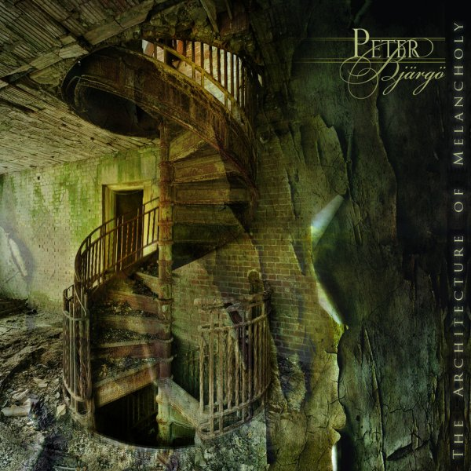

artist: **Peter Bjärgö** release: _The Architecture of Melancholy_ format: CD year of release: 2011 label: [Cyclic Law](http://www.cycliclaw.com/) duration: 40:19

detailed info: [discogs.com](http://www.discogs.com/Peter-Bj%C3%A4rg%C3%B6-The-Architecture-Of-Melancholy/release/3317501)

**Peter Bjärgö** is best known as the man behind illustrious projects such as **Arcana** and **Sophia**, but this brand new solo album of his is certainly not something to dismiss as a side project. Over the course of this seven track album, which stays close to a traditional LP length, Bjärgö explores a song style that is somewhere between ambient and darkwave, with a strong role for electric guitar melodies with subtle effects to give them a bit of an exotic touch.

The opening title track is perhaps closest to the signature gothic ethereal style of Arcana, with backing vocals provided by **Ida Bengtsson**. The rich, warm production bears that distinctly Swedish colour that we also find in lots of **Cold Meat Industry** and **Cyclic Law** releases. Percussion and heavy layerings are abandoned in the lovely second track, "Bitteresque", which consists of just a minimal melody and brooding whispered vocals. We find similar calm and melancholic moods in the third and fifth tracks, while "Apathy" and "The Death of Our Sun" are full-blown songs again, with strong percussion, channeling that unique 1980s/1990s goth sound of inspirations like **Dead Can Dance** and **Black Tape for a Blue Girl**. While Arcana sometimes ventured a bit too close to such inspirations for my personal comfort, I find that this album avoids that pitfall for the most part. The long final track, then, is indeed a loop, a soft melody gently disintegrating, lulling the listener to the end of the album.

Not your usual Cyclic Law fare, this one, but a pleasant surprise for me. Nowadays it seems the goth scene is mostly about 4/4 industrial techno and fantasy folk, but _The Architecture of Melancholy_ is the kind of music you could still hear often around the year 2000 in the clubs: dark, melancholic, subtle, and dreamy.

Reviewed by **O.S.**

Tracklist:

1\. The Architecture Of Melancholy (6:47) 2. Bitteresque (4:44) 3. The Hidden Compass (3:59) 4. Apathy (5:08) 5. A Wheel Of Thoughts (4:05) 6. The Death Of Our Sun (5:24) 7. Sleep Dep.Loop1 (10:12)
