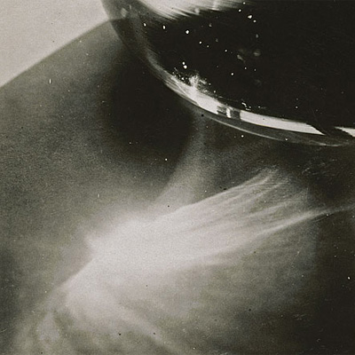

[Cloudscape #22: January 2012](http://www.mixcloud.com/eveningoflight/cloudscape-22-january-2012/?utm_source=widget&utm_medium=web&utm_campaign=base_links&utm_term=resource_link) by [Evening Of Light](http://www.mixcloud.com/eveningoflight/?utm_source=widget&utm_medium=web&utm_campaign=base_links&utm_term=profile_link) on [Mixcloud](http://www.mixcloud.com/?utm_source=widget&utm_medium=web&utm_campaign=base_links&utm_term=homepage_link)

00:00 | Joonatan Elokuu | Earth, Sky, Moon & Sun (Excerpt) | Earth, Sky, Moon & Sun | 2011 05:40 | The Cloisters | Sorgen | [Little Winter](http://www.eveningoflight.nl/2011/12/25/review-the-cloisters-little-winter-2011/ "Review: The Cloisters – Little Winter (2011)") | 2011 14:27 | Peter Bjärgö | Bitteresque | [The Architecture of Melancholy](http://www.eveningoflight.nl/2012/01/10/review-peter-bjargo-the-architecture-of-melancholy-2011/ "Review: Peter Bjärgö – The Architecture of Melancholy (2011)") | 2011 19:09 | Raising Holy Sparks | Here Begins Our Lasting Joy | [Beyond the Unnamed Bay](http://www.eveningoflight.nl/2012/03/19/review-raising-holy-sparks-beyond-the-unnamed-bay-2011/ "Review: Raising Holy Sparks – Beyond the Unnamed Bay (2011)") | 2011 22:49 | Circulation of Light | Meditation V | LEDNAH : Seven Meditations On G.F. Handel’s Organ Concertos Op. 4 | 2011 26:34 | The Doomed Bird of Providence | The Massacre of the Whole of the Passengers and Part of the Crew of The Sea Horse on Her Homeward Passage from Sydney Part 1 | [Will Ever Pray](http://www.eveningoflight.nl/2011/07/30/review-the-doomed-bird-of-providence-will-ever-pray-2011/ "Review: The Doomed Bird of Providence – Will Ever Pray (2011)") | 2011 36:36 | Current 93 | Niemandswasser | Sleep Has His House | 2000 42:26 | Tenhi | Savoie | [Saivo](http://www.eveningoflight.nl/2011/12/28/review-tenhi-saivo-2011/ "Review: Tenhi – Saivo (2011)") | 2011 45:22 | Phantom Dog Beneath the Moon | For Fear Look Outside | [In a Light....](http://www.eveningoflight.nl/2006/11/01/review-phantdom-dog-beneath-the-moon-in-a-light-2004/ "Review: Phantdom Dog Beneath the Moon – In a Light…. (2004)") | 2004 51:45 | Halo Manash | Hänesä Henget Eläwät | [DRONE-MIND//MIND-DRONE vol. 1](http://www.eveningoflight.nl/2012/02/14/review-v-a-drone-mindmind-drone-vol-1-2011/ "Review: V.A. – DRONE-MIND//MIND-DRONE vol. 1 (2011)") | 2011 53:51 | Bass Communion | Citadel (q) | Cenotaph | 2011 69:42 | The Floating World | Anthion | Compilation for a Cat | 2012
