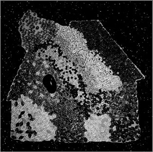

\[caption id="attachment\_2732" align="alignright" width="150" caption="Akhet"\]\[/caption\]

**Akhet** - _Akhet_ \[[discogs](http://www.discogs.com/Akhet-Akhet/release/3206750)\]

There are rare impromptu recording sessions where everything just comes together. _Akhet_ is a result of one of those, an incedental collaboration by **Paul van den Berg**, **Marc Verhaeghen**, and **Dirk Serries**. The four long tracks on this LP released by **Tonefloat** clock to almost an hour, filled with quirky electronics, soft drones, and frantic guitar work. Throughout these improvised tracks, there is a mysterious and at times psychedelic atmosphere vaguely connected to the Egyptian of the name of this project.

As has been noticed my man listeners and reviewers, there's a distinct 1970s krautrock feel to this album, but at the same time, you can detect the evolution of electronic music in the way the synths are applied. As a result, _Akhet_ doesn't sound quite like any particular thing, including the other works of the individual artists involved. All tracks on the album are interesting and fascinating, but I have to mention the last one in particular, which has  superb frenzied electronic looping going on, an energetic and intense climax to an excellent album.

\[caption id="attachment\_2751" align="alignright" width="150" caption="Dead Sons"\]\[/caption\]

**His Electro Blue Voice** - _Dead Sons EP_ \[[discogs](http://www.discogs.com/His-Electro-Blue-Voice-Dead-Sons/release/3234186)\]

The **Brave Mysteries** label pushes its boundaries again with this 12" EP by Italian band **His Electro Blue Voice**. _Dead Sons_ contains lots of speedy rock, a punk attitude, nicely layered effects, all giving a full sound to the screamy vocals and shredding guitars. Powerful driving bass and drums round out the heavier parts nicely. At the same time, there are experimental parts, like the psychedelic flute-based ending of the first track, that add additional goodness to this record.

All of this just barely lasts twenty minutes, but that's good at times, and an EP like this doesn't outstay its welcome. A nice surprise this one, and a band to keep an eye on in the future if you're into ballsy, experimental rock.

\[caption id="attachment\_2736" align="alignright" width="131" caption="The Day of the Lord"\]\[/caption\]

**Ur** - The Day of the Lord - 060606 Session \[[discogs](http://www.discogs.com/Ur-The-Day-Of-The-Lord-060606-Session/release/2580403)\]

This 2010 release on **Abgurd** records consists of four tracks deep in the realm of dark ambient and noise. The long first track is based on low, deep rumblings, obscured voices, and other tiny variations. The second track slowly and convincingly builds up to climax in a churning mass of noise, drones, and distorted screams. The final two tracks are a bit calmer once more, with the final track being the most interesting, where a bass guitar line and screeching violin add a touch of occult rock to the album.

All in all, not a particularly special album, but it is reasonably varied in its mix of various industrial influences, and the atmosphere is nice and obscure.
