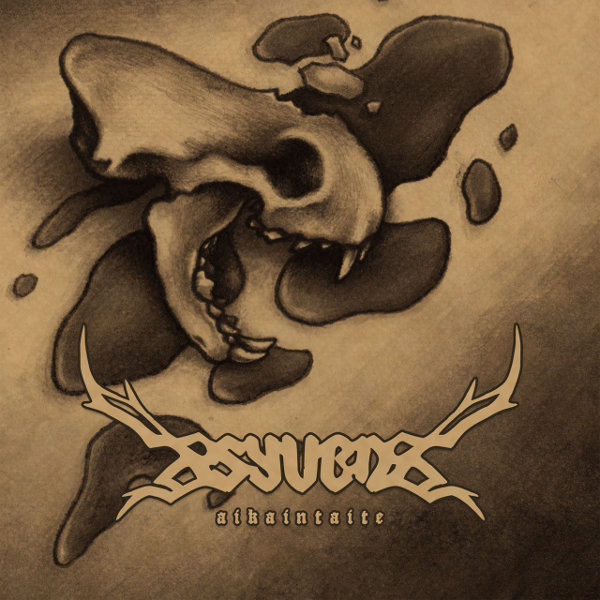

artist: **Syven** release: _Aikantaite_ format: CD year of release: 2011 label: [Vendlus](http://www.vendlus.com/) duration: 64:55

detailed info: [discogs.com](http://www.discogs.com/Syven-Aikaintaite/release/3280951)

A new project from Finland is the duo **Syven**, consisting of **A. Tolonen** whom we remember as the main artist behind **Nest**, and **Andi Koski-Semmens**, a vocalist previously in **Pantheist** and **Ereipia**. Together they've put together a debut album of five tracks in which they combine shamanic folk/ambient with light metal influences, and it follows in the line of their track "How Fare the Gods?" which featured on the compilation _[Whom the Moon a Nightsong Sings](http://www.eveningoflight.nl/2010/10/13/review-v-a-whom-the-moon-a-nightsong-sings-2010/ "Review: V.A. – Whom the Moon a Nightsong Sings (2010)")_.

The main ingredients of Syven are comparable to Nest, in the sense that synths, the Finnish kantele, and skin drum percussion form the musical basis. Andy's classical bass voice and the distorted guitar-like kantele sounds are new, though the album does feel like a continuation of or elaboration upon the music of Nest.

The first track, "Syvvys", feels like a more ambient and ritual intro to the rest of the album, in which the second and third long tracks form the central part. These lengthy compositions have a level, flowing rhythm where all aspects of the music get a chance to shine, although at times the music fades a bit into the background as well, on account of the constant cadence. There are subtle changes in intensity in these tracks, and in the dense parts menacingly growling vocals can be heard in the background. "Jäänkätkemä" is a calm ambient piece with just kantele and voice, a brief bit of respite after the heavier foregoing tracks. "Tuulenvire", finally, is the coda to the album, where a stronger layering of sounds is again built up, as well as a threatening atmosphere and some samples of fauna and weather.

_Aikantaite_ is an essential listen for those who are familiar with the music of Nest, but there is plenty to discover for newcomers as well. It's quite hard to pigeonhole the music, because the atmosphere is somewhere in between. It has a strong tie on the one hand to a nordic shamanistic sound, but not quite in the way that some other bands do. The sound is a touch softer and more polished in a certain sense, perhaps also because of Andy's velvety voice. Regardless, this own sound sets Syven apart from other projects, and you'll have to find out for yourself if that's a good thing. I certainly dig it, and _Aikantaite_ is an excellent and original debut album.

Reviewed by **O.S.**

Tracklist:

1\. Syvyys (6:55) 2. Jäljet (19:22) 3. Ne, Jotka Selviävät Talvestamme (18:46) 4. Jäänkätkemä (7:45) 5. Tuulenvire (12:07)
