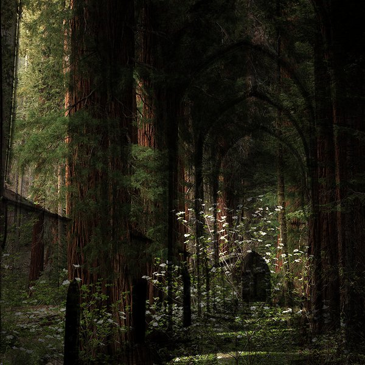

[Cloudscape #23: February 2012](http://www.mixcloud.com/eveningoflight/cloudscape-23-february-2012/?utm_source=widget&utm_medium=web&utm_campaign=base_links&utm_term=resource_link) by [Evening Of Light](http://www.mixcloud.com/eveningoflight/?utm_source=widget&utm_medium=web&utm_campaign=base_links&utm_term=profile_link) on [Mixcloud](http://www.mixcloud.com/?utm_source=widget&utm_medium=web&utm_campaign=base_links&utm_term=homepage_link)

00:00 | Ubeboet | Agone Revisited | [DRONE-MIND//MIND-DRONE vol. 1](http://www.eveningoflight.nl/2012/02/14/review-v-a-drone-mindmind-drone-vol-1-2011/ "Review: V.A. – DRONE-MIND//MIND-DRONE vol. 1 (2011)") | 2011 04:13 | Rain Drinkers | Helix I | [Yesodic Helices](http://www.eveningoflight.nl/2012/03/15/review-rain-drinkers-yesodic-helices-2012/ "Review: Rain Drinkers – Yesodic Helices (2012)") | 2012 12:05 | Language of Light | Inside the Head of a Butterfly Dreaming of Being a Giant Moth Destroying Tokyo (excerpt) | 2008 17:25 | Desiderii Marginis | Land of Strangers | Compilation for a Cat | 2012 22:44 | Wardruna | Løyndomsriss | Runaljod - Gap var Ginnunga | 2009 24:20-33:14 | Psychomanteum | The Zenith Gateway | Oneironaut | 2011 27:12 | United Bible Studies | Dark Lowland Plains | The Lunar Observatory | 2004 32:08 | Dim Arcana | Le Sue Mani Son Tempesta | Ars Populi | 2011 34:48 | URNA | Lha-mo | [Larvae](http://www.eveningoflight.nl/2012/05/31/may-2012-short-reviews/ "May 2012 Short Reviews (Alcest, The Dwindlers, Sujo, Urna)") | 2012 39:35 | Stone Breath | A Dream of You in the Garden of Gethsemane | Green Shrouds for Dead Gods... | 2002 44:41 | Ctephin | Teenrant Number 333 | Child Phonography | 2008 50:15 | Tactile | Grief | Grief (feat. John Balance) | 2005 55:06 | Raising Holy Sparks | Hanging on a Star | Kara Sevda | 2011 61:35 | Far Black Furlong | The East Room V | [John Barleycorn Reborn: Rebirth](http://www.eveningoflight.nl/2012/03/03/review-v-a-john-barleycorn-reborn-rebirth-2011/ "Review: V.A. – John Barleycorn Reborn: Rebirth (2011)") | 2007
