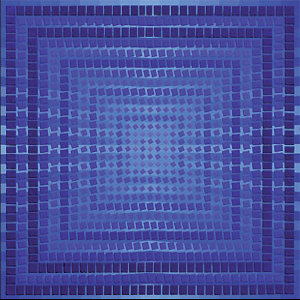

artist: **Ubeboet** / **Halo Manash** / **Jarl / b°tong** release: _DRONE-MIND//MIND-DRONE vol. 1_ format: LP year of release: 2011 label: [Drone](http://www.dronerecords.de/) duration: 52:47

detailed info: [discogs.com](http://www.discogs.com/Various-DRONE-MIND--MIND-DRONE-Vol-1/release/3289421)

After an impressive 100 seven-inch releases, the _Drone_ series by **Drone Records** recently came to an end. And while the ten-inches of **Substantia Innominata** are still running, the label decided to start a new range of records as well. The first emanation is this, volume one in the _DRONE-MIND//MIND-DRONE_ series, LPs split between a selection of different artists, but still focusing on dark ambient and drone music.

Spanish project **Ubeboet** (a Danish word meaning 'uninhabited') kicks off side A with two wonderful tracks. Both are are deep forays in dark ambient territory with mysterious chanted vocals and other samples, and wonderful use of violin in the background in the second track. A possible reference here would be **raison d'être**, although Ubeboet displays a slightly more subtle style here. Excellent work!

A familiar name for we was the Finnish project **Halo Manash**, who've done excellent work in ritual ambient in the past decade or so. The two tracks here are sparser than some of their material, eschewing heavier percussion in favor of drones based on deep gongs and horns. Both are excellent pieces with an emphasis on sustained tones and room for air.

The B-side opens with one long track by **Jarl**, and one that has quite a dark and thrilling atmosphere. A two-tone loop and some of its harmonics form the basis of the whole track, over which are laid all sorts of drones, plucked piano strings, and tiny effects and samples.

**b°tong** closes this four-way split album with four shorter tracks. The first is based on a distorted and manipulated voice sample, while the second his a more acqueous drone sound, with bubbles and currents. The third is the longest, some six minutes, and it is built on looping soft sounds, again with a bit of a watery and echo-y feel to it. The final track, "Pam", is more in the direction of traditional 'dungeon' dark ambient: oppressive echoes, metallic clangs, and dripping moisture.

The LP is a fascinating showcase for four different drone and ambient artists, and that is perhaps the essence of everything ever done by Drone Records. Although I have a personal preference for the A-side here, there is much to love, and subtle variation in the presentation of these four artists. A glorious debut on coloured vinyl for this new series, and a highly recommended release for all droners out there. Here's to the future!

Reviewed by **O.S.**

Tracklist:

1\. **Ubeboet** – Akasa 2. **Ubeboet** – Agone Revisited 3. **Halo Manash** – Hänesä Henget Eläwät 4. **Halo Manash** – Luiden Lukija

5\. **Jarl** – Zero In Scream 6. **b°tong** – Vam 7. **b°tong** – Lam 8. **b°tong** – Ram 9. **b°tong** – Pam
