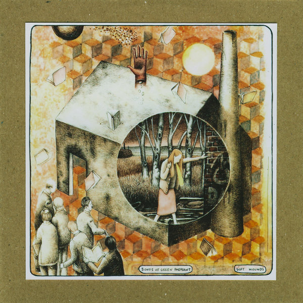

artist: **Songs of Green Pheasant** release: _Soft Wounds_ format: CD year of release: 2012 label: [Rusted Rail](http://www.rustedrail.com/) duration: 38:08

detailed info: [discogs.com](http://www.discogs.com/release/3375152)

From the category 'albums that need a few spins to click' comes the latest release on **Rusted Rail;** it is Sheffield's **Duncan Sumpner** and his fourth album as **Songs of Green Pheasant**. At first listen it seemed a relatively average bit of indie rock / folk crossover material, but over time the subtleties and quality of these compositions reveal themselves.

The style description above is more or less valid, though. In a number of tracks, acoustic guitar and Sumpner's wispy voice are combined with a steady backing of bass, drums, and piano, lending a light rock touch to the songs. Other tracks are stripped down, relying on an interplay of guitar and accents on trumpet and piano.

This includes two of my favourite tracks, which are even instrumental: "For People" and "Sad Flowers (Viva Happiness)". Both are wonderfully understated melancholic works. Speaking of which, there's a beautiful sadness in "Mirror" as well, and the long "Flesheaters" has its own share of lovely moments.

_Soft Wounds_ is only the latest in a row of releases that cement Rusted Rail's reputation as one of the finest alternative folk labels in Europe at the moment. For me, this is another warmly gentle record to cherish, a gem that comes recommended to all lovers of indie folk, singer/songwriter, and the like.

Reviewed by **O.S.**

Tracklist:

1\. Teenwolf (5:14) 2. Self Portrait With A Dog (2:53) 3. Deaf Sarah (4:21) 4. For People (2:19) 5. Mirror (4:09) 6. Flesheaters (9:37) 7. Sad Flowers (Viva Happiness) (5:34) 8. Lemon Yellow (4:01)
