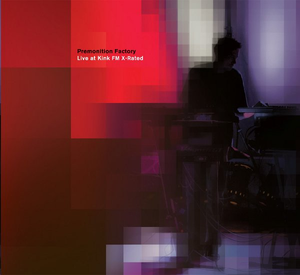

artist: **Premonition Factory** release: _Live at Kink FM X-Rated_ format: CD year of release: 2012 label: [Longstreet](http://premonitionfactory.com/) duration: 62:39

detailed info: [discogs.com](http://www.discogs.com/release/3418979)

_[The Sense of Time](http://www.eveningoflight.nl/2011/03/29/review-premonition-factory-the-sense-of-time-2011/ "Review: Premonition Factory – The Sense of Time (2011)")_ was one of our favourite records of last year, and it proved that **Sjaak Overgaauw** has a brilliant touch in balancing recordings for a studio album. This new one proves there is a similar balance in his live works. Actually, it is not that surprising since he uses the save live synth improvisation technique for both purposes, with the only difference that always you have to do things right immediately when playing live.

On September 4th of 2011, **Premonition Factory** was to be the last live guest performance in the **X-Rated** show on **Kink FM**, the radio station that ceased broadcasting on October first - more on that story [here](http://www.eveningoflight.nl/2011/10/01/cloudscape-tribute-to-kinkfm-x-rated/ "Cloudscape: Tribute to KinkFM X-Rated"). In a set of around forty minutes, Sjaak incorporated many of the elements that made his album works so successful thus far.

The first part introduces a calm, serene theme based on synth waves and delicate melodic piano touches, ending relatively silently, fading into the second track with a soft fuzzy drone. Quickly, the dominating rhythmic pulsations of that second piece fade in, which forms the basis of an uplifting piece. The third part is shorter again, and extremely soft, calm, and lower in volume. Gradually, as the set moves into its final part, darker drones and clouds of sound enter into the mix, though maintaining the calm atmosphere.

As a bonus, two shorter live performances (or outtakes) are included on the CD. The first one, "28 seconds", was recorded in Cologne. It is a relatively dark piece, with some ominous background tones, and gentle piano touches providing the main melody. A quite engaging piece, featuring subtle rhythmic glitches and a great development. The final track, "Live in Brussels", ends the album on a mysterious note, with darker and more ambiguous tones.

This album reconfirmed my conclusions after seeing Premonition Factory perform live in Amsterdam recently: Overgaauw masterfully translates this style from studio work to a live setting, by virtue of using practically the same methods. So, keep this is mind: seeing him live and this album are both experiences to cherish.

Reviewed by **O.S.**

Tracklist:

1\. X-Rated Pt. 1 (13:38) 2. X-Rated Pt. 2 (11:03) 3. X-Rated Pt. 3 (6:05) 4. X-Rated Pt. 4 (8:46)

5\. 28 Seconds (12:08) 6. Live In Brussels (10:56)
