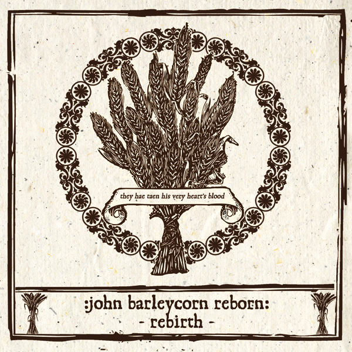

artist: **Various** release: John Barleycorn Reborn: Rebirth format: 2xCD year of release: 2011 label: [Cold Spring](http://www.coldspring.co.uk/) duration: 2:32:05

detailed info: [discogs.com](http://www.discogs.com/Various-John-Barleycorn-Reborn-Rebirth/release/3219330)

Perhaps it was to be expected that after the original _[John Barleycorn Reborn](http://www.eveningoflight.nl/2007/11/01/review-john-barleycorn-reborn-2007/ "Review: John Barleycorn Reborn (2007)")_ 2CD set and last year's 'sequel' _[We Bring You a King with a Head of Gold](http://www.eveningoflight.nl/2011/04/16/review-v-a-we-bring-you-a-king-with-a-head-of-gold-2010/ "Review: V.A. – We Bring You a King with a Head of Gold (2010)")_, the MP3-only supplement to the former compilation would be put on CD as well. Originally, it was a bonus release from **Woven Wheat Whispers**, and as you can read in my review, it contained quite a few nice additional tracks to what was featured on the CD. Now that this material is out on CD as well, thanks to **Cold Spring**, it's time to go over them again.

CD 1 starts with some traditional folk numbers, where **The Story**'s track stands out a bit because of its strong instrumentation and psych folk revival style, while we get supreme relaxation from **David A Jaycock** and **Yealand Redmayne**. A bit of mediaeval material comes from **Steve Tyler** and **The Wendigo**, though the best of this genre is found on the second disc. I failed to really notice the track last time around, but the Tigon Mix of **The Owl Service**'s "Wake the Vaulted Echo" is rather excellent as well: mysterious and a tad offbeat with its folky electronica style. I've mentioned (and played) the superb coda to **Far Black Furlong**'s _[The East Room](http://www.eveningoflight.nl/2007/10/01/review-far-black-furlong-the-east-room-2006/ "Review: Far Black Furlong – The East Room (2006)")_ plenty of times, so once more can't hurt. Other tracks of note on the first CD included the dark ghost story by **The Straw Bear Band**, and the lovely freefolk of **The Big Eyes Family Players**.

The second disc contains quite a few nice works as well. There's psychedelic and dreamy pieces from artists like **Cunnan**, **Orchis,** and **Twelve Thousand Days,** as well as a soaring a capella by **Clive Powell**. More mediaeval goodness comes from **Daughters of Elvin**, and particularly from **Misericordia** with their brilliant hammered dulcimer-based "De Ponir Amor a Me". **Sedayne** and **Rachel McCarron** join together as **Venereum Arvum** again with a wonderful version of Child Ballad 102, a lovely vocal harmony and a great melody, too.

Altogether, this bonus set to the original compilation is very much worth picking up if you didn't get the digital version at the time, now unavailable, or if you prefer to have it on CD, which is reason enough by itself. Together with _We Bring You a King with a Head of Gold_, these two instalments of _John Barleycorn Reborn_ make a fascinating set of 6 CDs featuring some of the best artists from British alternative folk today, which is an essential part of any folk lover's collection. At the same time, after these sets, I feel it's been enough, and it would be interesting to see a collection of all the lovely folk that's been made in the rest of the world in the past decade. There are loads of gems out there waiting to be discovered by a wider audience.

Reviewed by **O.S.**

Tracklist:

1-01 **Magpiety** – The Rolling Of The Stones 1-02 **The Story** – All Hallow's Eve 1-03 **Telling The Bees** – Wood 1-04 **David A Jaycock** – Bonny Jaycock Turner 1-05 **Yealand Redmayne** – Oh My Boy, My Bonny Boy 1-06 **Charlotte Greig & Johan Asherton** – The Bold Fisherman 1-07 **Steve Tyler** – Tierceron 1-08 **The Wendigo** – The Wendigo 1-09 **The Owl Service** – Wake The Vaulted Echo (Tigon Mix) 1-10 **Far Black Furlong** – The East Room V 1-11 **Xenis Emputae Travelling Band** – Brightening Dew 1-12 **Sedayne** – Corvus Monedula 1-13 **The Straw Bear Band** – Bear Ghost 1-14 **Novemthree** – Scythe To The Grass 1-15 **Paul Newman** – Lavondyss 1-16 **James Reid** – Kingfisher Blue 1-17 **JefvTaon** – (Digging The) Midnight Silver 1-18 **Wooden Spoon** – Children's Soul 1-19 **The Big Eyes Family Players** – A Dream Of Fires

2-01 **Sundog** – Improvisation At Kilpeck, June 2007 2-02 **Clive Powell** – Ca The Horse, Me Marra 2-03 **Mac Henderson And Grand Union Morris** – Jack In The Green 2-04 **Cunnan** – Seven Sleepers, Seven Sorrows 2-05 **Orchis** – The Silkie 2-06 **Twelve Thousand Days** – Thistles 2-07 **Novemthree** – Harvest Dance 2-08 **James Reid** – Elder 2-09 **Mary Jane** – When I Was In My Prime 2-10 **Daughters Of Elvin** – Ognor Mi Trovo 2-11 **Misericordia** – De Poni Amor A Me 2-12 **Venereum Arvum** – Child 102 (Lily Flower Mix) 2-13 **The Anvil** – John Barleycorn Must Live 2-14 **Sunshine Coding** – The Old Way
