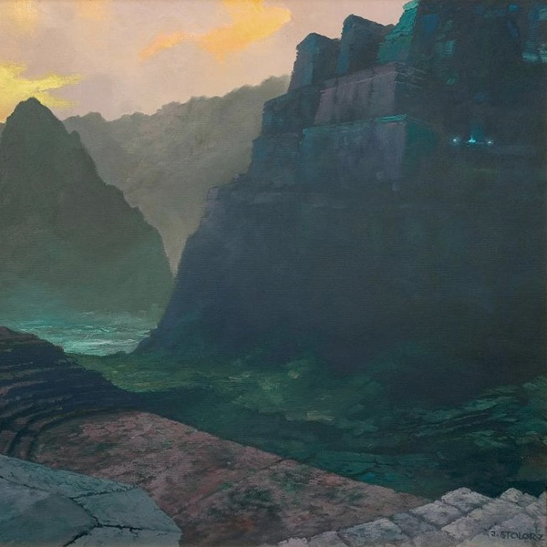

<iframe width="600" height="600" src="https://www.mixcloud.com/widget/iframe/?feed=%2Feveningoflight%2Fcloudscape-24-march-2012%2F" frameborder="0"></iframe>

Artwork: _Land of Endless Hankering_ (2004) by **[Józef Stolorz](http://art.stolorz.com/)**

00:00 | Raising Holy Sparks | Hallelujah | [Beyond the Unnamed Bay](http://www.eveningoflight.nl/2012/03/19/review-raising-holy-sparks-beyond-the-unnamed-bay-2011/ "Review: Raising Holy Sparks – Beyond the Unnamed Bay (2011)") | 2011 01:46 | Adrian Anioł | Slowly Downward | Arrhythmia | 2012 06:27 | Nature and Organisation | III | [Death in a Snow Leopard Winter](http://www.eveningoflight.nl/2012/03/10/eclipse-review-nature-and-organisation-death-in-a-snow-leopard-winter-1998/ "Eclipse Review: Nature and Organisation – Death in a Snow Leopard Winter (1998)") | 1998 10:06 | Baldruin | Die Purpurinsel | [Nachtfalter](http://www.eveningoflight.nl/2012/04/29/review-baldruin-nachtfalter-2012/ "Review: Baldruin – Nachtfalter (2012)") | 2012 12:57 | The Gray Field Recordings | Honey Locust | [Nature Desires Nature](http://www.eveningoflight.nl/2012/05/09/review-the-gray-field-recordings-nature-desires-nature-2012/ "Review: The Gray Field Recordings – Nature Desires Nature (2012)") | 2012 17:41 | Songs of Green Pheasant | Mirror | [Soft Wounds](http://www.eveningoflight.nl/2012/02/18/review-songs-of-green-pheasant-soft-wounds-2012/ "Review: Songs of Green Pheasant – Soft Wounds (2012)") | 2012 21:39 | Peter Bjärgö | Apathy | [The Architecture of Melancholy](http://www.eveningoflight.nl/2012/01/10/review-peter-bjargo-the-architecture-of-melancholy-2011/ "Review: Peter Bjärgö – The Architecture of Melancholy (2011)") | 2011 26:12 | Aspectee | Roter Wald | Jour Cinq | 2011 29:49 | Mulm | Night Water Reflection | The End of Greatness | 2012 37:12 | Premonition Factory | X-Rated pt. 4 | [Live at Kink FM X-Rated](http://www.eveningoflight.nl/2012/02/28/review-premonition-factory-live-at-kink-fm-x-rated-2012/ "Review: Premonition Factory – Live at Kink FM X-Rated (2012)")| 2012 42:30 | Locrian | The Clearing | The Clearing | 2011 58:14 | March of Heroes | Parmi la Poussière et les Ruines | [La Chute](http://www.eveningoflight.nl/2012/03/12/review-march-of-heroes-la-chute-2011/ "Review: March of Heroes – La Chute (2011)") | 2011 60:26-72:30 | Maarten van der Vleuten | Burden | The Scars Remain | 2011 64:37 | Void of Silence | Grey Horizon (M.P.H. MMIV) \[excerpt\] | Human Antithesis | 2004 70:17 | Eric Brosius | Down into the Bonehoard \[excerpt\] | Thief Gold Score | 1999
