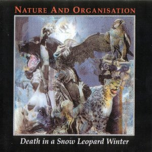

artist: **Nature and Organisation** release: _Death in a Snow Leopard Winter_ format: CD year of release: 1998 label: Snow Leopard / World Serpent duration: 41:19

detailed info: [discogs.com](http://www.discogs.com/Nature-And-Organisation-Death-In-A-Snow-Leopard-Winter/release/400546)

If _Death in a Snow Leopard Winter_ has been given a bit of a stepmotherly treatment in the annals of music history, it is undoubtedly because it will forever stand in the shadow of its predecessor. _Beauty Reaps the Blood of Solitude_ was perhaps the quintessential neofolk album of the 1990s, with a star cast of **David Tibet**, **Douglas Pearce**, and **Rose McDowall**, alongside many other excellent guest musicians. and of course **Michael Cashmore** as main composer. Several of that album's songs ("Bloodstreamruns", "My Black Diary", "Bonewhiteglory") feature among the highlights of the genre, and its instrumental passages and industrial elements did nothing to hurt the album's appeal either.

This album is quite different. As Cashmore himself indicated in the liner notes, it is unfinished, and he had planned to add woodwinds, percussion, and vocals, but was forced to abandon these compositions at an early stage. In their current form, the twelve movements are for piano (by Cashmore himself) and string quartet (**Elizabeth Toney**, **Jeremy Jackson**, **Hannah Walker**, and **Dan Bradley**). Judging by the description, the final work would have been a grand (chamber) orchestral piece, and with this in mind it's understandable that Cashmore presents the album as a "rough mix", unworthy of anything more than a mid-price CD.

But perhaps he is selling himself short. In retrospect, and treating it as a finished album instead, _Death in a Snow Leopard Winter_ is a beautiful composition, and it is the minimal instrumental setup that lends it part of its charm. It is here, to my knowledge, that Cashmore for the first time presents his romantic classical compositions in this form, alternating delicate and very minimal melodic piano passages with emotional swells and full sweeps of strings. Not only does it work perfectly for these compositions - though I'm sure the full orchestral version would have been great, as well - it also foreshadows the sparse style of Cashmore's later work such as _Sleep England_ and _The Snow Abides_. In that sense alone this is a valuable album.

But, context aside, this album is simply very beautiful, and favourite piece of my collection for special moments. It works equally well on cozy dark evenings at home, as on solitary treks through the woods, regardless of season, though winter is perhaps the obvious time. It lends itself well to calm contemplation and a bit of nostalgia or weltschmerz, and perhaps the romantically inspired but also modern compositions are perfectly suited for such a mood.

There are few composers who venture into this style of music nowadays, but those that do are valuable, taking the step from more folky song based music to compositions that are more expansive and loose, while keeping a sort of organic and romantic feeling. **Richard Moult**, though with a style wholly of his own, is one of the few others who does this with great success. As such, many of the compositions coming from these people are works to treasure. _Death in a Snow Leopard Winter_, though unfinished as such, is definitely one of those.

Reviewed by **O.S.**

Tracklist:

1\. (3:27) 2. (1:01) 3. (3:50) 4. (4:41) 5. (3:30) 6. (4:47) 7. (4:34) 8. (3:42) 9. (1:24) 10. (3:53) 11. (4:05) 12. (2:25)
