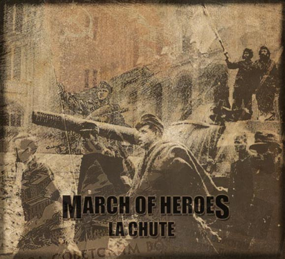

artist: **March of Heroes** release: _La Chute_ format: CD year of release: 2011 label: [Steinklang](http://www.steinklang-records.at/) duration: 71:49

detailed info: [discogs.com](http://www.discogs.com/March-Of-Heroes-La-Chute/release/3385513)

I always approach martial industrial records with a sense of trepidation, as there are a lot of so-so, uninspired albums out there, in a genre that is rather claustrophobic, if we're totally honest. Too many copycats, rehashing of themes, and so forth. In that context, _La Chute_ didn't look all that promising with its sepia war pictures and French titles indicating all sorts of wartime thematics. Listening to the music, a number of potential little irritants are there as well: the obligatory use of samples of crackly classical music and gunfire, speeches, etc.

However, after a few listens, there is something about the general composition of this album that just works quite well. **March of Heroes** (the project of **Romain L.**, and with guest appearances by **Jim Breedveld** and **Mitchell Keepin**) infuses the tried and true martial motifs into an album that feels most like a score to a film or even a video game. Mostly shying away from the standard marching tracks and devoid of any lyrics as such, the tracks on _La Chute_ are very layered, and mostly blend into each other, forming a long soundscape.

While there are several tracks where powerful rhythm plays a major role - "Un Appel aux Armes" incorporates the same bombastic classical sample as **Karjalan Sissit**'s "Kunnia Isänmaa", for example - a lot of it is calmer, and the mood is mostly sad, oppressive, and sorrowful, rather than aggressive or glorifying. Melody comes predominantly from soft synth layering, while additional melody and texture is provided by the aforementioned samples, environmental sounds, and here and there some lighter percussion.

Perhaps the reminiscence of soundtrack or score comes from some of the samples used. At least one I recognise outright: the lovely dream sequence theme by **Michael Hoenig** (the **Tangerine Dream** one), written for the classic game _Baldur's Gate_, originally released in 1998, and worked to great effect into the track "Parmi la Poussière et les Ruines". There are probably more of such (uncredited) elements.

So, while we can nitpick about the lack of thematic or stylistic originality, and the amount of borrowing work taking place here, _La Chute_ is still a very convincing album, dripping with an ominous atmosphere, somewhere between martial industrial and dark ambient. Even over a length of 70+ minutes, it has a sense of urgency and a flawless timing and flow. In other words, an extremely solid album that should be interesting to martial aficionados of course, as well as some skeptics like myself who find themselves drawn in despite initial misgivings.

Reviewed by **O.S.**

Tracklist:

1\. Introduction (6:50) 2. Leur Terre, Leur Sang (6:35) 3. La Guerre De L'Inconnu (4:00) 4. Un Appel Aux Armes (5:20) 5. Une Marche Pour La Gloire (3:00) 6. Collaborations (4:40) 7. Du Sang Sur Mes Mains (7:10) 8. Les Derniers Jours (4:00) 9. Pour Une Cause Perdue (5:10) 10. Parmi La Poussière Et Les Ruines (4:15) 11. L'Europe Après La Guerre (3:40) 12. La Chute (7:50) 13. La Liberation (4:20) 14. En La Memoire Des Disparus (4:59)
