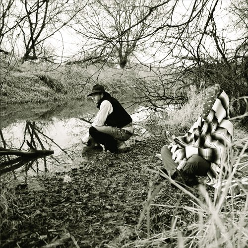

artist: **Rain Drinkers** release: _Yesodic Helices_ format: LP year of release: 2012 label: [Brave Mysteries](http://http://www.bravemysteries.com) duration: 30:17

One of my favourite discoveries from last year, and they're back already with their first LP release: Wisconsin's duo **Rain Drinkers**. **Zavier Krall** (pseudonym of **Troy Schafer**) and **Joe Taylor** have put out several albums since 2010, ranging from good to breathtaking, and as I had expected and hoped, this latest one is a worthy addition to the discography.

_Yesodic Helices_ starts with an atmosphere comparable to that of last year's wonderful _Springtide_: a fine layering of drones and violin, both covering bass and high frequencies. With a few broad strokes, these men paint a vast musical canvas from which to start, suffused with mental images and tiny details of sound. After about five minutes, lovely melodies on trumpet and guitar, as well as soft chants, take over to introduce a new tonality. It's uplifting on the one hand, but with notes of mystery and present danger as well. Rolling piano and drones continue the track from here, slowly building towards a subtle crescendo.

The second movement starts with some new low drones, faint piano, and electric guitar. A theme with soft percussion, organ, and flute develops out of this, still maintaining a rather calm vibe. Shortly after the halfway point, flute and guitar give way to a pulsating rhythm growing in intensity, and more and more instruments and sounds (percussion, deep bells) join in for the album's final climax. This section shares some elements with the title track on **Burial Hex**'s _[Book of Delusions](http://www.eveningoflight.nl/2011/09/21/review-burial-hex-book-of-delusions-2011/ "Review: Burial Hex – Book of Delusions (2011)")_ from last year, which is a compliment.

Though short for an album, _Yesodic Helixes_ feels more like a single 30-minute track, perfectly balanced and paced, and definitely on the level of the project's best releases so far. Reviewers are at a loss when they have to pigeonhole Rain Drinkers' music, and terms like "urfolk" get thrown around at times. This is a sure sign that some new things are happening here, and indeed you can hear influences from all over the place: folk, jazz, film music, ambient, drone, ritual, etc. Combined with an obscure spiritual imagery - what are these helices and what do they have to do with one of the _sephirot_? - and band image (mysterious names, unknown recording locations), and you have a great package. It must be clear I love these guys,  and I can't do anything but recommend this and their other works to all our dear readers.

Reviewed by **O.S.**

Tracklist:

1\. Helix I (15:23)

2\. Helix II (14:54)
