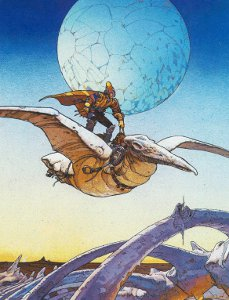

**Troy Schafer** (**Rain Drinkers**, **Wreathes**, **Kinit Her**) has generously shared one of his new mixes with us, featuring a short selection of inspiring music from various surprising directions.

More about Troy's own music here: < [http://soundcloud.com/troy-schafer](http://soundcloud.com/troy-schafer) > and here: < [http://troyallenschafer.bandcamp.com/](http://troyallenschafer.bandcamp.com/) >.

Artwork by **Mœbius** < [http://en.wikipedia.org/wiki/Jean\_Giraud](http://en.wikipedia.org/wiki/Jean_Giraud) >.

[Troy Schafer - Spring Hyacinth Mix](http://www.mixcloud.com/eveningoflight/troy-schafer-spring-hyacinth-mix/?utm_source=widget&utm_medium=web&utm_campaign=base_links&utm_term=resource_link) by [Evening Of Light](http://www.mixcloud.com/eveningoflight/?utm_source=widget&utm_medium=web&utm_campaign=base_links&utm_term=profile_link) on [Mixcloud](http://www.mixcloud.com/?utm_source=widget&utm_medium=web&utm_campaign=base_links&utm_term=homepage_link)

Tracklist:

**Phase II -** Candle In the Night - Band Talk **Nina Simone** - Black Is the Color of My True Love’s Hair **Charlemagne Palestine** - Strumming Music **Ennio Morricone** - Ecstasy of Gold **Yma Sumac** - Chuncho **Henry Flynt** - Central Park Vocal #2 **Pat Metheny Group** - Letter From Home **Henry Flynt** - Central Park Vocal #1 **Shirley & Dolly Collins** - Death & The Lady **Krzysztof Penderecki** \- Polymorphia **The Books** - Of The Word God **Alice Coltrane** - Universal Consciousness **Catherine Ribeiro + Alpes** - Jusqu'a ce que la Force de t'aimer me manque ****Phase II -**** Candle In the Night - Band Talk **Jermain Tamraz** - Dogle Shapire Live **Baligh Hamdi** - Zamane
