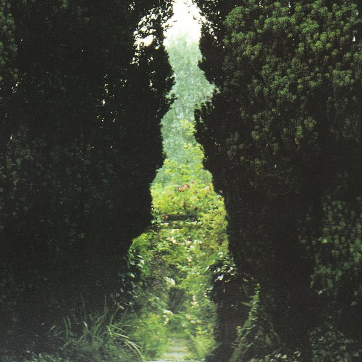

artist: **Troy Schafer** release: _Evening Song Awaken_ format: CD-R year of release: 2012 label: [Recital](http://www.recitalprogram.com/) duration: 41:00

detailed info: [discogs.com](http://www.discogs.com/Troy-Schafer-Evening-Song-Awaken/release/3441204)

**Troy Schafer**, involved in projects like **Rain Drinkers** and **Wreathes** has some solo works as well, and _Evening Song Awaken_ is to my knowledge his first full album release. As a classically trained violinist, Schafer gives centre stage to this instrument here, layering melodies and string drones, with a fascinating spectrum of compositional influences. Do read on, because this is one of my favourite releases of the year thus far.

The first grouping of tracks, "The Desire Towards Joy", is a romantic and melancholic classical composition, where the rhythm flows around the main melodic swoops. Here and there, we hear soft percussion thuds, and both low and high notes providing drones in the background at the end of the first cycle. The second cycle continues the romantic, flowing theme, and includes tiny hints of what might be soft vocals in the background. The "arpeggios" are a fine coda to this first trilogy of tracks, starting with thickly layered sustained bowing, and ending in the broken chords that give the piece its name.

"The Spring of Instinct" is a very short duo of atonal pieces, functioning perhaps as a bit of a quirky palate cleanser before the extended tracks that are to follow. "Let the Corpse of the Mind Lie Unburied..." is the longest composition on the album, and it is highly influenced by drone and minimal music. A few sustained note sequences form the basis for most of the track, which is embellished by small modifications and melodies. After four minutes or so, silence sets in briefly, giving way to trumpet (an instrument that Schafer uses sparingly and successfully in many of his projects) and experimental vocals, and soon joined by violin again. From here, a denser drone is again built up, with a relatively free tonal range, building towards an intense climax. The final track, "Faint Fresh Fire", features a few more other instruments, such as an organ and synth intro, bells, and more (I think) vocal work mimicking high-pitched animal voices. A brilliant piece that does quite a bit to tie in the purer violin works that came before with the more band- and ensemble-oriented music Schafer produces in his other projects.

In short, _Evening Song Awaken_ is the work of a confident and very accomplished violinist and composer, and one that is unafraid to push boundaries with his music. I have the utmost respect for Schafer's work, and this album, limited to 200 CD-R copies, should not be missing from your collecting if you value modern classical (violin) music, as well as innovative acoustic music in general.

Reviewed by **O.S.**

Tracklist:

1\. The Desire Towards Joy - Cycle I (6:09) 2. The Desire Towards Joy - Cycle II (4:39) 3. The Desire Towards Joy - Arpeggios (4:03) 4. The Spring Of Instinct - Cycle I (0:46) 5. The Spring Of Instinct - Cycle II (0:25) 6. Let The Corpse Of The Mind Lie Unburied On The Edge Of The Great Sea! (16:41) 7. Faint Fresh Fire (8:19)
