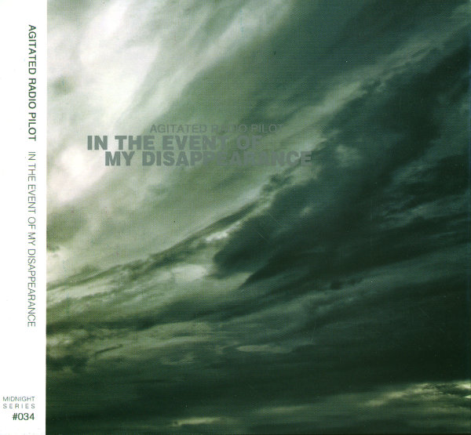
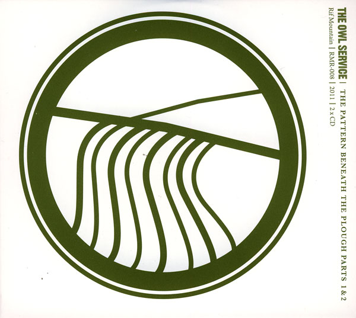
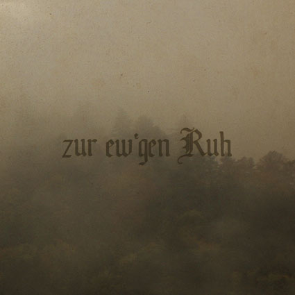

\[caption id="attachment\_2956" align="alignright" width="150" caption="In the Event of My Disappearance"\]\[/caption\]

**Agitated Radio Pilot** \- _In the Event of My Disappearance_ \[[discogs](http://www.discogs.com/Agitated-Radio-Pilot-In-The-Event-Of-My-Disappearance/release/3095162)\]

Alongside [our own double release](http://www.eveningoflight.nl/2011/07/23/eol03-agitated-radio-pilot-lights-beneath-the-lake-nothing-is-truly-lost/ ":EOL03: Agitated Radio Pilot – Lights Beneath the Lake / Nothing Is Truly Lost"), _In the Event of My Disappearance_, released on China's **Midnight Productions**, is one of the final ARP releases. And a fine one it is! **Dave Colohan** focuses mostly on piano-driven songs here, which is a new route compared to earlier albums. The songs are sparse, calm, and feature subtle additions of other instruments and vocals by guest artists like **Michael Tanner** and **Yasmin Chaudhry**.

All of the tracks breathe that calm beauty that characterises much of Colohan's work, but "Breath of Bells" must be the absolute standout, a gripping song with intense chorus climaxes on ebowed guitar. Some of the tracks stretch out into soundscapes, and the 20+ minute ambient EP _The Lunar Arcane_ is added as a lovely bonus track on this release. An essential release for ARP fans, and as always, worth a try for everyone with an ear for singer/songwriter and ambient drone crossovers.

\[caption id="attachment\_2962" align="alignright" width="150" caption="The Pattern Beneath the Plow Parts 1&2"\]\[/caption\]

**The Owl Service** \- _The Pattern Beneath the Plow Parts 1 & 2_ \[[discogs](http://www.discogs.com/Owl-Service-The-Patterns-Beneath-The-Plough-Parts-1-2/release/3410419)\]

This double album collects two earlier Owl Service releases (_The Burn Comes Down_ and _The View from a Hill_), as well as a selection of bonus tracks, good for nigh on two hours of traditional and revival-inspired British folk. The first disc focuses on some classic **Robert Burns** poems and songs, and I'm particularly fond of "When a Man's in Love", sung by guest vocalist and labelmate **Roshi Nasehi**. Of the plentiful bonus tracks on disc 1, the Gently Johnny-esque "Wake the Vaulted Echo" is rather nice (as is the Tigon remix on _[John Barleycorn Reborn](http://www.eveningoflight.nl/2012/03/03/review-v-a-john-barleycorn-reborn-rebirth-2011/ "Review: V.A. – John Barleycorn Reborn: Rebirth (2011)")_). The longer "By the Setting of the Sun" is quite enjoyable as well, with a good dollop of **Pink Floyd** thrown in there. On the second disc, I was particularly drawn to "Willie O'Winsbury", another delightful mix of traditional and later revival sounds (sitar!). Another good recording is "Within Sound", always a fascinating few verses. Ending the album with a superb version of **Gwydion Pendderwen**'s "Spring Strathspey" is a good move as well.

Though I'm not too fond of all the vocalists in The Owl Service - that's a matter of personal slant - and although the band's music could bear a bit more experimental influences, they are easily one of the most interesting projects in modern British folk music. This double album summarises well what they're capable of, and really the only reason not to check it out is if you already have the separate releases that constitute it.

\[caption id="attachment\_2944" align="alignright" width="150" caption="Zur Ew'gen Ruh"\]\[/caption\]

**Sturmpercht / Rauhnacht** - _Zur Ew'gen Ruh_ \[[discogs](http://www.discogs.com/Sturmpercht-Rauhnacht-Zur-Ewgen-Ruh/master/406924)\]

This EP was released late 2011 on **Percht Records**, a member of the **Steinklang** family. These two austrian folk (inspired) artists teamed up for a two track work combining neofolk and black metal, with that typical atmosphere of dark nature mysticism that has been so inspiring since the early nineties.

The first track has the usual acoustic neofolk basis, but with a lot of additional instruments, such as bells, jew's harp, flute, accordion, and wind sounds. The vocals alternate between whispers and harmonic chants, quite in the line of German bands like **Orplid** and **Empyrium**. The mysterious atmosphere is maintained into the second song, where the acoustic elements blend with the metal. This mix of elements works quite well, and is similar to the style of bands like **Windir** or **Negură Bunget**, to name just two.

Both songs feel like integral parts of a whole, and this short EP is a very good and cleanly produced stylistic exercise, if not really groundbreaking. Certainly recommended for those who don't mind mixing their metal and folk somewhat!
