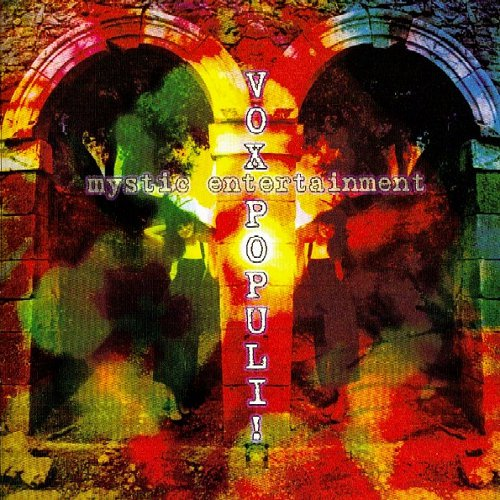

artist: **Vox Populi!** release: _Mystic Entertainment_ format: CD year of release: 2009 label: [Infrastition](http://www.infrastition.com/) duration: 77:19

detailed info: [discogs.com](http://www.discogs.com/Vox-Populi-Mystic-Entertainment/release/1854214)

_Mystic Entertainment_ is something of an archival release, spanning the years 1984-2009, and it served as my introduction to the music of **Vox Populi!**. Though this French band is probably known by those who specialise in the history of industrial in various European countries, I don't believe it ever gained a lot of prominence in the international music world. This is partially understandable from the sound as it is showcased on this album, which deviates quite strongly from that of some of the more well-known industrial pioneers from the eighties. Focusing less on harsh and mechanical sounds, the music of Vox Populi! has a much stronger influx of middle-eastern folk, coupled with synth works and an atmosphere that is often dreamlike and upbeat.

The core of the band consists of songwriter, vocalist and instrumentalist **Axel Kyrou**, lead singer and guitarist **Mitra Kyrou-Khalatbari**, and **Arach Khalatbari**, who adds percussion, voice, and various other instruments. In addition, a great deal of guest musicians collected throughout the years add a low of flavour on different tracks. Lyrics alternate between French and if the folk song "Chirine" is anything to go by, Persian.

And the tracks are many, averaging around three minutes apiece, which keeps the album flowing along nicely. It's surprising how well they all mesh together, even though they come from different periods and are haphazardly, not chronologically, mixed. That doesn't mean there is no variation or development in the band's sound. Just a sample: "Crépuscule Sur Alamout" has a repetitive guitar base with voice, violin, and tabla. "Gizigini" is a very uplifting, bass-heavy track with a variety of instruments and percussions, as is the happy "Letsam La". On the other hand, there are a few calmer tracks, such as the melancholic "Be Modar", and the mystical setar-based "Deltangui", where the synthetic rhythm flows together perfectly with the percussion, acoustic melody and voice.

Despite the disparate source material, _Mystic Entertainment_ works very well as a whole, and it's great to be able to rediscover the band on CD, as this is the first proper release of their work in twenty years. In short, essential listening for those interested in the variety of sounds that arose in the European underground of the early eighties, especially the blending of industrial and synth music with folk.

Reviewed by **O.S.**

Tracklist**:**

1\. Chaque Jour Est Un Bon Jour (1993) (1:55) 2. Crépuscule Sur Alamout (1992, 2009) (5:32) 3. Bedroud (1984) (2:16) 4. Gizigini (1993) (3:14) 5. Douneye Achk (1998, 2009) (3:32) 6. Gol Bekarim (1993) (3:12) 7. Le Son Est Ton Nom (1993) (4:27) 8. Chapati Train (1993) (1:53) 9. Indian Bloom (1994) (2:26) 10. Chirine (1990) (3:06) 11. Getting To Know Saturn (1992) (1:55) 12. Letsam La (1993) (3:39) 13. Be Modar (1985) (3:31) 14. Tu Renverses Encore ! (1989) (0:07) 15. Charob (2000, 2009) (2:33) 16. Doumai V3 (1998, 2007) (2:10) 17. Getting To Know The Moon (1993) (2:56) 18. Icucme (1996) (3:33) 19. Sunshine Boys And The Time Keeper (1990) (3:08) 20. Managana (2001) (2:09) 21. Koro Song (1989, 2001) (3:16) 22. Remembering Ancient Fights (1987) (3:01) 23. Deltangui (1985) (5:30) 24. Atacumba's Power Meditation (1991) (2:26) 25. An Ethereal Vision (1992) (4:52) 26. Clothes For The Nude Emperor (1986) (1:00)
