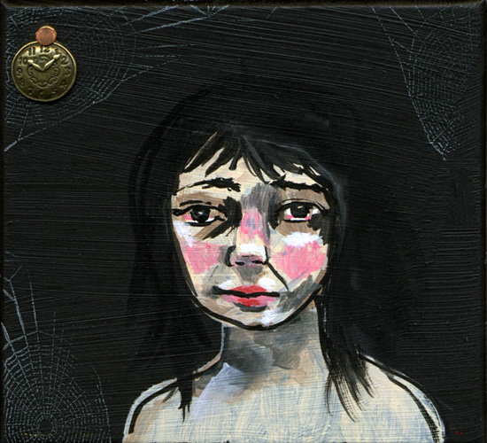
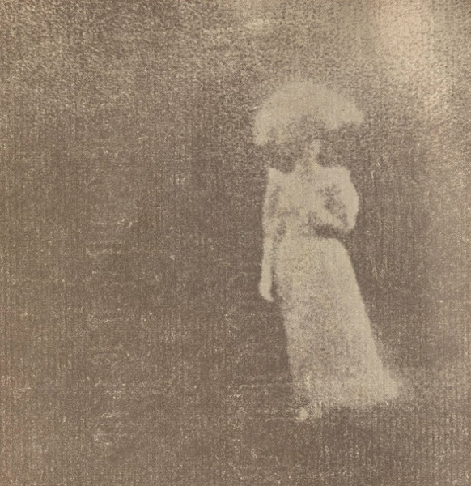

\[caption id="attachment\_3040" align="alignright" width="150"\] Limited Edition\[/caption\]

\[caption id="attachment\_4013" align="alignright" width="146"\] Regular Edition\[/caption\]

artist: **Taskerlands** release: _Taskerlands_ format: 2x3" CD, CD year of release: 2012 label: [Time Released Sound](http://timereleasedsound.com/) duration:  41:44

detailed info: [discogs.com](http://www.discogs.com/Taskerlands-Taskerlands/master/438374)

Lately I've been toying around with the idea that one of the most significant developments in the recent history of music is the (rere)revival of folk, and particularly the new horizons subsequently explored by artists involved in this revival. While I won't derail this review with too much contemplation of that musical current, let me at least say that the highly individual developments that some artists undergo are often combined in this network-organised scene in collaboration albums, and these can result in even more intricate musical evolutions.

More concretely: **Taskerlands** is the love child of **Michael Tanner** (**Plinth, The A. Lords**) and **David Colohan** (**Agitated Radio Pilot, Raising Holy Sparks**), whose paths crossed earlier in **United Bible Studies**. Both are artists who have carved an impressive niche for themselves in that loose international network of musicians that might very well be a current, working not only solo in a variety of acoustic, electronic, and folk-inspired ways, but also as supporting musicians for many other artists. This album, however, is the first where both come together as a creative duo, fusing their unique styles in something sounds unmistakably like something 'Tanner and Colohan', yet which you'd be hard put to hear anywhere else.

Even more concretely: this means two twenty-minute soundscapes, based on flowing melodies and drones for guitar and effects, with added colour in the form of bass clarinet (**Seán Mac Erlaine**, previously working as **Sean Òg**), piano (**Kerrie Robinson**), and 'frequencies' (**Richard Moult**). Though there are at least two small breaks, both pieces can be considered part of one big whole which breathes the gentle atmosphere that corresponds perfectly to the titles they chose for these tracks: as if a landscape - as green as Britain or Ireland - was submerged under the ocean, and we could pass through its terrain with the ease of a fish, taking in the fusion of an aquatic landscape with one that used to be dry, and wondering at the sights.

In terms of composition or improvisation - perhaps a combination of both - _Taskerlands_ runs the gamut from minimal music and ambient pioneering to gentle free jazz and the pastoral atmospheres of psychedelic folk, elements we could already find in parts of both Plinth's and Agitated Radio Pilot's oeuvre, but nowhere as intensely merged as on this marvellous album. The combination of soft meandering melodies and a melancholic droning touch is something both men excel in.

If my first paragraph makes sense, then this project is something of a poster child for the musical movement I'm as yet struggling to describe, in which folk influences meet up with ambient and jazz, and so much more. Not only that, but it is a luscious work simply as it stands, without its historical context.**Time Released Sound** should be honoured to be releasing this end of April, in a special handmade boxed edition, as well as a regular CD following later. I for one am going to cherish this as much as some of the other brilliant works by these artists, and so should you. Here's hoping they'll get together again some time.

Reviewed by **O.S.**

Tracklist:

1. In Forests Submerg'd, No Season Brooks Heeding (20:53)

2. Drowned Land Bridges Of Britain (For Clement Reid) (20:51)
