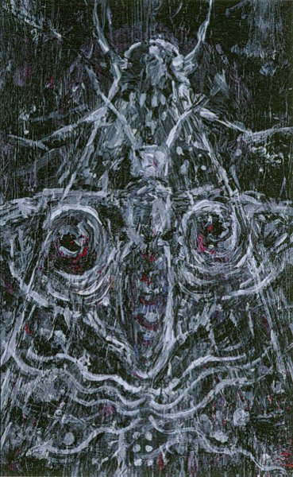

artist: **Baldruin** release: _Nachtfalter_ format: MC year of release: 2012 label: [Brave Mysteries](http://www.bravemysteries.com/) duration: 29:57

detailed info: [discogs.com](http://www.discogs.com/Baldruin-Nachtfalter/release/3447248)

A new name on the **Brave Mysteries** label is the Bavarian artist **Baldruin** (**Johannes Schebler**), who's had a few earlier tape releases. The latest album displays this solo artist's love for mysterious and uncanny freefolk sounds.

It's a mix of different acoustic instruments (strings, flutes, percussion, voices) with added effects and manipulations - a style that you don't hear too often, but which has its parallels in the music of **The Gray Field Recordings**, **Xenis Emputae Travelling Band**, and **Robin Crutchfield**. The short snippets that form the tracks on _Nachtfalter_ ('Night Butterfly') are like glimpses into a nocturnal fairytale forest, and that should be interpreted in the darker primordial sense, rather than with Disneyfied connotations. There is a sense of lurking danger in the music, and fear, but also moments of wonder and fascinating mystery.

Though I wouldn't consider the style of this album extremely original, it's not like you hear this kind of album every day either. Besides, Baldruin's compositions proceed at a pace that brings variety, with something new around the corner every two or three minutes. As such, _Nachtfalter_ is well worth the low price of a tape album, especially if you favour the darker and quirkier sides of folk and acoustic improvisations.

Reviewed by **O.S.**

Tracklist:

1\. Irrweg (1:20) 2. Wildwuchs (3:20) 3. Undine (3:09) 4. Hohlraum (1:37) 5. Am Hang (2:57) 6. Sackgasse (2:25)

7\. Siebente Reise (3:41) 8. Spiegelung (1:11) 9. Weit DrauBen (3:11) 10. Schünwunde (2:19) 11. Die Purpurinsel (3:42) 12. Xerocomus (1:05)
