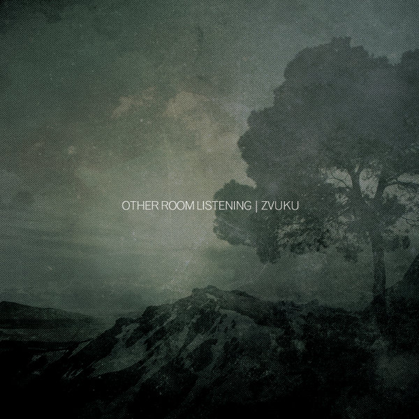

artist: **Zvuku** release: _Other Room Listening_ format: CD-R, Digital year of release: 2012 label: [Futuresequence](http://www.futuresequence.com) duration: 41:23

With all my dejection over stagnation in music in recent years and critiques of nostalgia and retro-mindedness hanging in the air everywhere, it's nice to be reminded that I can still be thoroughly impressed by somebody's album-length debut. Enter **Zvuku**, the project of Irishman **Karl McGrath**. I'd become familiar with Zvuku's music through the lovely free _SEQUENCE_ compilations put out by **Futuresequence** earlier, and the tracks "Woodpile" and "Cold" have featured in our Evening of Light Cloudscapes before. These tracks already stood out greatly from the rest because of their clarity of composition and sound; a simple plucked violin loop, piano-based sound layerings, etc. Two EPs were put out earlier as well, but _Other Room Listening_ is the first full-length album.

The appeal of Zvuku's sound textures derives in part from the use of such acoustic instruments (piano, guitar, violin) as basic input for the music. Throughout this album, melodies are presented as is, or layered with more or less intense manipulations: reverb, static, loops. This sense of drifting in-and-out of direct audibility is the central feature of the often ghost-like tracks on _Other Room Listening_, and the title itself indicates part of that experience. Some parts of the music are heard as if somewhere else, in some metaphorical other room.

Opener "Logpile" sounds like an abstracted version of that earlier track, "Woodpile", redone in the style of this album, with more of an emphasis on rushing waves of sound and ambiences, rather than staccato melodies. The longest track, "Cold Yellow Red Blue" takes this to the extreme, several parts being washed in gorgeous static, like shoegaze without the rock part, but ending at the same time in a clean, fragile piano piece. The rest of the tracks, two of medium length, two short, continue this theme of melancholic melodies and alternations between direct and hazy sound.

At times, Zvuku's music recalls recent works by **Richard Moult** or **Richard Skelton**, in the sense that they too often rely on manipulation of acoustic instruments to generate soundscapes and other extended compositions. I'd have to say that Zvuku's approach is less repetitive in terms of looping than Skelton's music, more varied in instruments than Moult's, though absolutely nothing to the detriment of those artists. What I mean to say is that Zvuku has a very strong musical voice of its own, but one with stylistic parallels in the work of others. That voice of McGrath's is as convincing here in forty minutes as on his earlier, shorter works, or perhaps even more, and he can be proud of this first album, a masterpiece in the traditional sense: a test of skill that proves a former apprentice has got what it takes.

Essential listening for lovers of ambient and electro-acoustic works. There is a limited edition of 50 copies on CD-R with art print - lovely design by the label - but after that the album will remain available as a digital download.

Reviewed by **O.S.**

Tracklist:

1\. Logpile (6:35) 2. Cold Yellow Red Blue (17:48) 3. The Long Walk (3:51) 4. Matches/Sticks (5:59) 5. Cold Yellow Reprise (1:59) 6. Lastone (5:13)
