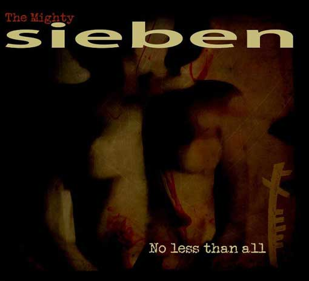

artist: **Sieben** release: _No Less Than All_ format: CD, LP year of release: 2012 lable: [Redroom](http://www.matthowden.com/sieben/no-less-than-all) duration: 47:10

detailed info: [discogs.com](http://www.discogs.com/Mighty-Sieben-The-No-Less-Than-All/master/431333)

As **Sieben, Matt Howden** has been nothing if not consistent, maintaining his original voice as both a frequent live performer and a studio artist and technician. His violin looping and layering technique and singing voice make him a unique and instantly recognisable artist, even after over fifteen years of work.

The last two studio albums (_As They Should Sound_ excluded, as it concerns reworkings of older tracks) have marked a direction deeper into rock territory, and _No Less Than All_ is the latest and most rigorous step in that direction. Mind you, it's still violin-based, but most of the songs on these albums have a solid underpinning of bass and percussion, just not played on the traditional instruments. The compositions however, are song-based, and derive their appeal from track-specific hooks and rhythms.

Howden's sophistication as a songwriter and producer often shines through, whether it is in funky plodding tracks like "Shake the Tree" or the more uptempo opener "Music Is Light". The use of different vocal angles and layerings is also more apparent on this album, all contributing to a very polished sound. The cover of **Joy Division**'s classic "Transmission" is a bullseye as well, a velvety production sound, but with all of the energy of the original. A downside, though, is that it has more of that energy than most of Howden's own compositions on this album, and the second half of the album falls a bit flat. Each of the songs makes me go "yes, well done", but only rarely am I truly gripped by the tracks on display here.

At such times I feel it might have been better if the new straightforward style had been tempered a bit with the more expansive composition featured in some of Howden's solo works under his own name, or the more conceptual albums from around the 2005 era. Looking back, it was albums like _Ogham inside the Night_ and _High Broad Field_ that truly got me into Sieben, and these haven't been truly equalled by any of the later albums.

That said, _No Less Than All_ is likely to deliver enough quality listening time for many Sieben fans, and it serves as a fine and catchy introduction to Matt Howden's impressive and thoroughly original oeuvre for those who are just having a look for the first time.

Reviewed by **O.S.**

Tracklist:

1\. Music Is Light (5:30) 2. Preacher Online (3:23) 3. I Saw A Face (3:55) 4. Vonnegut (3:54) 5. Transmission (3:25) 6. Shake The Tree (4:16) 7. Black Dog Day (4:14) 8. No Ordinary Life (4:08) 9. He Can Delve In Hearts (3:45) 10. In A Train (4:07) 11. No Less Than All (4:34) 12. Music Is Light, Part II (Play Me Again) (1:59)
