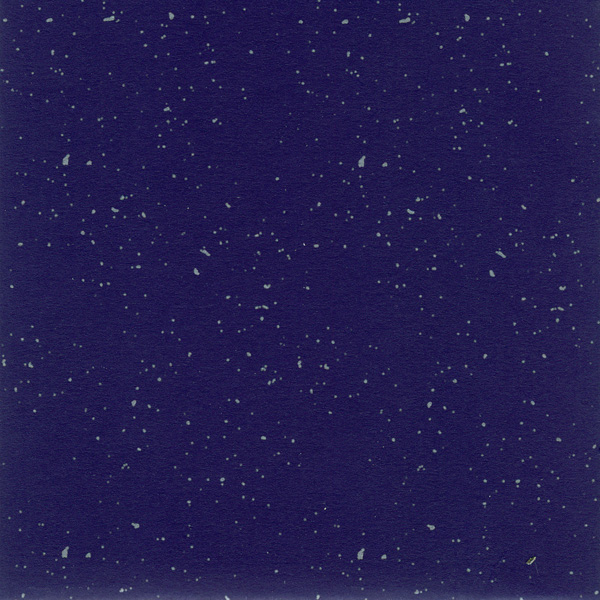

artist: **The Gray Field Recordings** release: _Nature Desires Nature_ format: CD-R year of release: 2012 label: [Reverb Worship](http://reverbworship.com/) duration: 44:12

detailed info: [discogs.com](http://www.discogs.com/Gray-Field-Recordings-Nature-Desires-Nature/release/3381044)

Consistently far too deep below the radar, **The Gray Field Recordings** is one of those artists that operate in a unique and fascinating area at the crossroads of experimental folk and electronica, yet whom I rarely see mentioned by anyone else. I've been touting the virtues of **R. Loftiss**' project since the beginning of this website in 2006, and it's good to see this latest album picked up by a prolific underground label such as **Reverb Worship**, though once more in a limited edition of 51 copies, an amount that should be sold at least five times over based on the quality of the music Loftiss has put out in the past eight years.

Previous album _[The Weaver's Daughter](http://www.eveningoflight.nl/2009/09/03/review-the-gray-field-recordings-the-weavers-daughter-2009/ "Review: The Gray Field Recordings – The Weaver’s Daughter (2009)")_ was one of my favourite records of 2009, and thankfully _Nature Desires Nature_ follows in its stylistic footsteps. Opener "Nature" combines dark guitar drones with deep strings and other instruments by guest artists with semi-melodic spoken word by Loftiss herself and **Mike Seed**. The second track is even more typical of the TGFR sound, with Loftiss' wispily echoing spoken word pieces rolling over a minimal e-piano melody, and unnerving samples of rustling and cracking wood.

The folk inspirations for this music are directly on display in a dark rendition of "Willow Waly", one of the few occasions where Loftiss herself sings on this album. **Justin Jones**' violin work also comes to prominence here, another steady and excellent guest artists on TGFR albums. A couple more impressions: "A Descent" is a long, minimal piece with eerie voices and drones, whereas "Scared of Wolves" is a nervous fairytale piece, featuring spoken word by **Alan Trench** (**Twelve Thousand Days, World Serpent**) and building up to a noisy climax. The double final track, then, is one of the oddest pieces, with an out-of-place (though nothing is truly out-of-place in this music) funfair melody and Loftiss singing in a thin voice, again devolving into wild noise and a short coda.

As you will be able to deduce, this is a pretty gloomy album, but brimming with atmosphere. Unnerving snatches of old songs, environmental sounds, ghosts, stars, these are but a few of the images _Nature Desires Nature_ brings me. It's perhaps a touch less melancholic than the previous album, and has a few more tracks with longer minimal drones, but that only serves to set it apart enough and prevent it from being a copy. Once more, I can only heartily recommend this excellent latest album by The Gray Field Recordings, and it is my wish that these recommendations don't fall on too many deaf ears.

Reviewed by **O.S.**

Tracklist:

1\. Nature (5:03) 2. The Maple Seldom Inward Sound (4:06) 3. Willow Waly (3:57) 4. Star Bells (1:54) 5. A Descent (6:10) 6. Scared Of Wolves (5:20) 7. Honey Locust (5:26) 8. Cherubim Wheels (5:07) 9.1. A Little World (4:49) 9.2. In A Field Or Far Away... (2:20)
