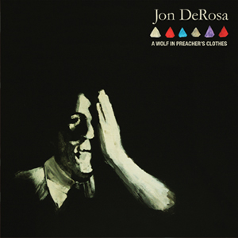

artist: **Jon DeRosa** release: A Wolf in Preacher's Clothes format: LP year of release: 2012 label: [Mother West](http://www.motherwest.com/) duration: 41:56

Not too long after the introductory _[Anchored EP](http://www.eveningoflight.nl/2011/08/20/review-jon-derosa-anchored-ep-2011/ "Review: Jon DeRosa – Anchored EP (2011)")_, **Jon DeRosa** (**Aarktica**) presents his first solo LP under his own name. In the style of _Anchored_, DeRosa delves deep into music history, coupling his own songwriting with stylistic influences from perhaps every decade since the 1940s. Guitar and voice are central to the songs on _A Wolf in Preacher's Clothes_, but equally important are the arrangements for strings, brass, organ, and backing vocals. There's bits of classic crooning in here, a good helping of soul, and the spirit of new wave.

The albums opens quite strongly with the uptempo "Birds of Brooklyn", and particularly the waltzing "True Men", a prime showcase for DeRosa's delightfully warm voice. "Snow Coffin" is one of two tracks off the _Anchored EP_ that also feature here - a lovely piece with driving rhythm section, cello (**Julia Kent**), and excellent vocal harmonies. This somewhat sad piece is followed by "Teenage Goths", which is as uplifting as the previous song is contemplative; it's one of the tracks that embodies the eclectic mix of pop influences on this album the best. The first half ends with **The Blue Nile'**s "Easter Parade", a marvellous cover that keeps the emotional intensity of the original, but with delicate piano, cello and trumpet notes added.

After an A-side that's excellent all the way through, the beginning of B is a bit underwhelming. The first three tracks are all good enough, but don't stand out all that much, and the retro influences of the album become almost too much on tracks like "Who Decides" and "Don't Say Goodnight", where the compositions and lyrics are barely original enough to keep them from slipping into simple old-timey music fetishism. Good thing that the last two tracks are there to remind us of what DeRosa _also_ has to offer us. The dark folky "Ladies in Love" is as beautiful here as it was on _Anchored_, and the reworking of **Aarktica**'s "Hollow Earth Theory" is a marvellous closer. The original was nice enough, but the added arrangements for cello and **Lorraine Lelis**' always flawless backing vocals take this track to where it truly needs to be.

Despite a couple of less interesting tracks, _A Wolf in Preacher's Clothes_ delivers on the great promise of the preceding EP, and DeRosa proves beyond doubt that he can pull off the ambitious combination of a broad spectrum of influences. At the core of it all is sophisticated songwriting, something which he's been doing for at least fifteen years, but clothed in rich arrangements by the excellent guest musicians. As such, it's an album that's difficult to classify, but perhaps we can go back to The Blue Nile and the awkward genre moniker of _sophisti-pop._ Although we're three decades on, and DeRosa's album doesn't sound like an 80s album at all, the mix of influences is sort of comparable, and it is quite simply that: sophisticatic pop music. So yeah, that's a recommendation, folks!

Reviewed by **O.S.**

Tracklist:

1\. Birds of Brooklyn (3:11) 2. True Men (4:07) 3. Snow Coffin (4:07) 4. Teenage Goths (3:42) 5. Easter Parade (5:40)

6\. Tattooed Lady's Blues (3:39) 7. Who Decides? (3:54) 8. Don't Say Goodnight (5:21) 9. Ladies in Love (3:31) 10. Hollow Earth Theory (4:44)
