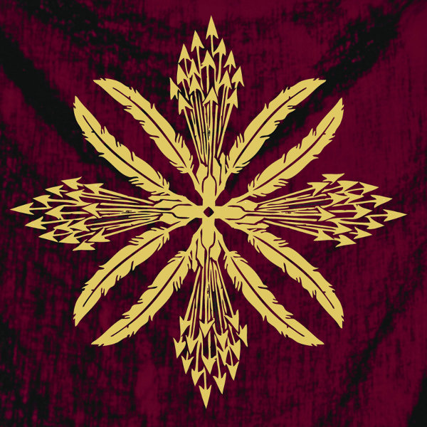

artist: **Wreathes** release: _Wreathes_ format: LP year of release: 2012 label: [Pesanta Urfolk](http://www.pesanta.com) duration: 32:54

detailed info: [discogs.com](http://www.discogs.com/Wreathes-Wreathes/release/3606661)

I didn't really need any more convincing, but **Wreathes**' self-titled debut LP proves all the more that Wisconsin is a hotbed of creativity. **Nathaniel Ritter** and **Troy Schafer** have already proven their skill both in stylistic variation and composition, but this project sees them opening up a new avenue once more. Though close to their work as **Kinit Her**, the material on this album is perhaps more predominantly song-based - _perennialist pop_, as they call it themselves.

And yes, that descriptor hits the right notes. _Wreathes_ sounds a fair bit like a pop record in an alternate history where the cards have been shuffled a bit differently. There are songs, verses and choruses, but the sound is unlike most things we've heard. Perhaps this is the pereniallist part - a sort of hidden but continuous line of musical tradition going back throughout the ages. Though, to be fair, the music sounds mostly like a fantastic _imagining_ of what such music might be like: a thoroughly singular blend of pop structures, folk, marching rhythms, epic vocal harmonies, and rock.

Opener "Odes" is probably my favourite track off the album, with its peerless soaring chorus and strong percussion, and "The Reigns" is definitely in the same league with its layered vocals near the end. But really, all of the material on this LP breathes the same unique atmosphere and style. The melodies of each composition are worked into different instrumental lines (organ, bass, guitar, violin, trumpet), giving a rich tapestry of sound to each song, while the vocals (harmonies as well as background voices) are usually most prominent of all.

The thing is, _Wreathes_, like a lot of Kinit Her material, is as weird as it is unique. I'm at a loss to describe exactly _what_ the music sounds like (therefore a video below). That of an acid folk band surely, but with a military touch, and vocalists who sound like they got stuck halfway between being viking raiders and the monks they were raiding. Let's not forget poetry and universal (perennialist?) spiritual themes, which are both subtle veins through everything this duo produces. The risk Wreathes are taking is that this sheer weirdness will alienate a lot of listeners. For me, it depends on the mood: sometimes I get it, sometimes I don't, even though I got it the day before. Perhaps such risk is inevitable when treading new ground.

Don't let that put you off: even if it might turn out not to be your thing, give it a listen anyway, or you'll never know. In any case, _Wreathes_ is one of those essential outsider steps in the evolution of music, like many of Ritter and Schafer's works. If you're sold, rejoice in the stunning LP put together by **Pesanta Urfolk**, limited to 500 copies with 133 on an amazing [bone-splatter colour edition](https://www.facebook.com/photo.php?fbid=373335286036690&set=a.373335279370024.73868.173434686026752&type=1). I for one am glad of the unique voices drifting across the world from Wisconsin, and I'm looking forward to more Wreathes and Kinit Her works.

\[vimeo 20494010\]

\[Note: this version of "The Reigns" comes from an earlier 7" of the same name, and it's a slightly different recording from the one on this album.\]

Reviewed by **O.S.**

Tracklist:

1\. Odes (6:08) 2. Bones of Love (5:00) 3. The Reigns (5:10)

4\. Speech of the Tides (6:55) 5. The Great Gate (5:11) 6. Blessed Exits (4:30)
