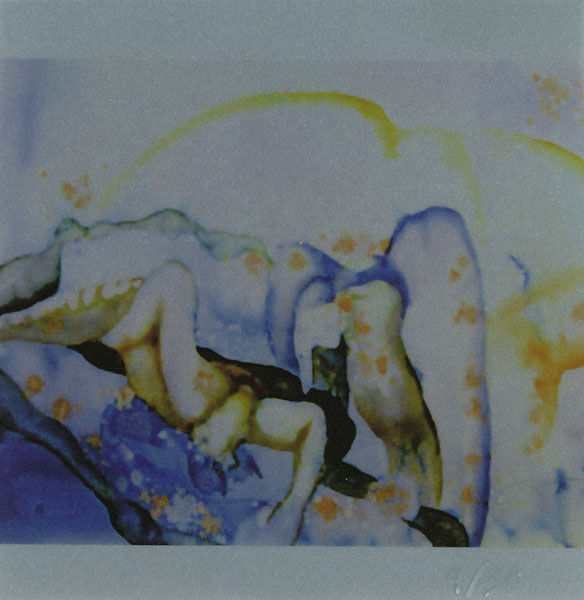

\[caption id="attachment\_3122" align="alignright" width="150" caption="Les Voyages de l'Âme"\]\[/caption\]

**Alcest**  - _Les Voyages de l'Âme_ \[[discogs](http://www.discogs.com/Alcest-Les-Voyages-De-L%C3%82me/master/395853)\]

After a re-release of the excellent EP _Le Secret_ and as previous full-length that has grown on me despite initial misgivings, I expected rather a lot from the new Alcest album. Certainly more of that magical dreamy mix of shoegaze fuzz and extreme metal influences. With that in mind, I'm sorry to say that I was disappointed. Most tracks on _Les Voyages_ are what we at this point call by the book for Alcest, meticulously put together, but without any truly surprising or riveting riffs or passages.

The album is partly redeemed by two of its tracks, though. "Faiseurs de Mondes" is the most black metal-influenced number on _Les Voyages_, and it combines its harshness with a delicious waltzing bridge and a storming blastbeat coda that brims over with energy. If only there were more of such dynamics on this album. The same goes for the gloriously dreamy title track, which is easily one of the band's best songs to date. This album is worth giving a chance for these two tracks alone, but overall, I hope **Neige** will be able to bring more to the table next time.

\[caption id="attachment\_3077" align="alignright" width="106" caption="Allegories"\]\[/caption\]

**The Dwindlers** \- _Allegories_ \[[discogs](http://www.discogs.com/Dwindlers-Allegories/release/3540770)\]

A little under 30 minutes, _Allegories_ is a short but sweet album from the duo **Michelle Seaman** and **Benjamin Dauer**. Michelle's poetry is set to music by Benjamin: a very smooth and enjoyable mixture where bass-heavy jazz and electronica meet. The physical edition of the release includes a booklet with the text, designed by **Leonardo Rosado**.

The allegories of the title find expression in creative verses that blur the lines between human and machine, human and animal. The surreal words mesh nicely with the relaxing but never trite musical arrangements, which occasionally drift into more ambient territory, particularly later in the album. All this works extremely well, and the warm production finishes the album off excellently. Recommended listening for everyone with an ear for poetry and experimental music settings.

\[caption id="attachment\_3242" align="alignright" width="146" caption="Diaspora"\]\[/caption\]

**Sujo -** _Diaspora_ \[[bandcamp](http://sujo.bandcamp.com/)\]

The limited **Diaspora** album I found in my mailbox one day was a pleasant surprise. This project of **Ryan Huber** is definitely in that part of the underground where guitars shell out walls of massive sound, sometimes in the form of drones, sometimes in tracks where the rhythms betray influences from extreme metal, both slow and fast.

Opener "Six Days" has a funeral doom pace to it, prompting me to pull out **Shape of Despair**'s debut album, despite this track being in 4/4. It's more in the drum structure and fuzzy waves of melody. The following tracks vary in tempo, but have that same focus on shoegazy washes of guitar sound, and Sujo pulls it off well with enough variation in the tracks and some surprising touches in the composition here and there.

Though in a rather limited edition, _Diaspora_ is well worth checking out if you're into heavy hitters like **Nadja** and **Locrian**.

\[caption id="attachment\_3133" align="alignright" width="92" caption="Larvae"\]\[/caption\]

**Urna -** _Larvae_ \[[discogs](http://www.discogs.com/Urna-Larvae/release/3447263)\]

Italian project **Urna** makes its debut on **Brave Mysteries** with this fascinating tape. It's minimalistic ritual tracks are full of chants, bells, gongs, and woodwinds, channeling sacred music from India and the Himalayas, but through the lens of industrial music. The first couple of tracks are drifting affairs, but at the third one, repetitive rhythms surface as well. Particularly "Lha-Mo" is a very effective track, its reverb-drenched (goblet?) drums pounding out an ethereal dance. The chants in the final track, "Hannya", are damn impressive as well.

All in all an excellent tape album if you're into ritual industrial and far-eastern spiritual music combined.
