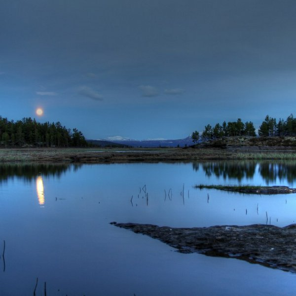

[Cloudscape #27: June 2012](http://www.mixcloud.com/eveningoflight/cloudscape-27-june-2012/?utm_source=widget&utm_medium=web&utm_campaign=base_links&utm_term=resource_link) by [Evening Of Light](http://www.mixcloud.com/eveningoflight/?utm_source=widget&utm_medium=web&utm_campaign=base_links&utm_term=profile_link) on [Mixcloud](http://www.mixcloud.com/?utm_source=widget&utm_medium=web&utm_campaign=base_links&utm_term=homepage_link)

00:00 | Witxes | Unlocation | Sorcery & Geography | 2012 04:30 | Sabled Sun | This Is Where the World Ends | 2145 | 2012 09:40 | Lost Harbours | Spring's Fire | Hymns and Ghosts | 2012 14:36 | Zvuku | Matches/Sticks | [Other Room Listening](http://www.eveningoflight.nl/2012/05/01/review-zvuku-other-room-listening-2012/ "Review: Zvuku – Other Room Listening (2012)") | 2012 20:25 | Jon DeRosa | Easter Parade | [A Wolf in Preacher's Clothes](http://www.eveningoflight.nl/2012/05/24/review-jon-derosa-a-wolf-in-preachers-clothes-2012/ "Review: Jon DeRosa – A Wolf in Preacher’s Clothes (2012)") | 2012 25:36 | EUS, Postdrome & Saåad | Drone Me Tender | Sustained Layers | 2012 29:11 | Silent Watcher of Dark Matter | Bipolar Outflow 1 | Installation | 1999 36:25 | Jim Guthrie | And We Got Older | Sword & Sworcery LP | 2011 40:51 | Circulation of Light | Cycle VII | Cycles I-VIII | 2009 46:26 | Stone Breath | How Many Hours 'til the Spider's Work Is Done? | [Twist of Thorn](http://www.eveningoflight.nl/2012/05/19/review-stone-breath-twist-of-thorn-2012/ "Review: Stone Breath – Twist of Thorn (2012)") | 2012 55:00 | Taskerlands | Drowned Land Bridges of Britain (For Clement Reid) | [Taskerlands](http://www.eveningoflight.nl/2012/04/24/review-taskerlands-2012/ "Review: Taskerlands (2012)") | 2012

Photography by Erlend Vartdal: [http://www.flickr.com/photos/evartdal/5796061752/](http://www.flickr.com/photos/evartdal/5796061752/)
