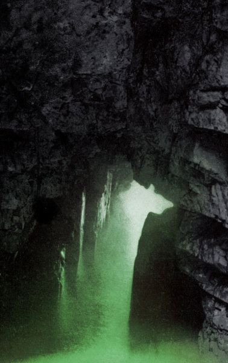

artist: **EUS, Postdrome** & **Saåad** release: _Sustained Layers_ format: MC & Digital year of release: 2012 label: [BLWBCK](http://www.blwbck.com/catalog/) duration: 44:05

More tape revival goodness came to my attention by way of this excellent ambient collaboration on **BLWBCK** records from France. These three artists (from Costa Rica, the UK, and France, respectively) worked together on _Sustained Layers_, and the joining of efforts certainly paid off.

As the title suggests, layering of different textured sounds is the focus of this album, and the result is something of that aural geology that is the hallmark of many interesting ambient and drone records. Though dense and obscure, the opening tracks have a fuzzy calmness to their slowly moving melodies. That atmosphere is lifted, however, by the threatening theme of "Drone Me Tender", a rather dark and nocturnal affair. The album weaves back and forth between these atmospheres in a convincing manner, introducing a touch of relaxation with "Limbo" and "Inner Cold", but returning to heavier areas with "3AM", of which you can view the ingenious video below. The final track provides a calm coda, a dawn after what has mostly been an album of nighttime moods.

_Sustained Layers_ is perhaps an unsurprising album, but it is very well done and pleasant to listen to, on par with many of the releases from the **Cyclic Law** roster, for example. If you're a dark ambient lover _and_ a tape lover, best be quick, because at the time of writing there are only a few of the 67 copies left. Otherwise, there's always the digital edition to check out.

http://www.youtube.com/watch?v=oASzRIig3jw

Reviewed by **O.S.**

Tracklist: 1. Arrows of Night (6:44) 2. 3PM (3:56) 3. Drone Me Tender (5:00) 4. Limbo (4:15)

5\. Inner Cold (8:58) 6. 3AM (5:34) 7. Destruction (6:47) 8. Dawn (feat. **Metal Alvin**) (2:51)
