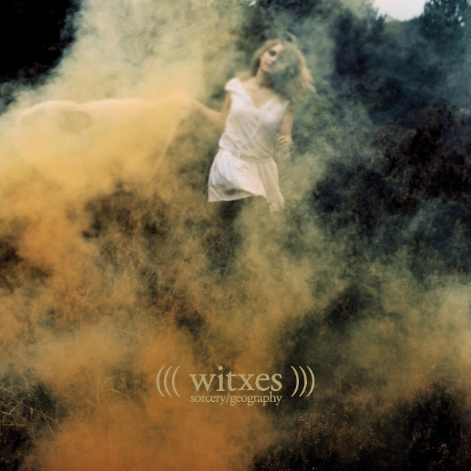

artist: **Witxes** release: _Sorcery/Geography_ format: LP, Digital year of release: 2012 label: [Humanist](http://www.humanistrecords.com/) duration: 43:13

detailed info: [discogs.com](http://www.discogs.com/Witxes-SorceryGeography/release/3662631)

It's often fruitful territory: ambient where electronics are mixed with clearly audible acoustic instruments, as opposed to music where the latter only serve as base material for far-reaching effects and manipulation - a fruitful approach in its own right, don't get me wrong. What's nice about a clear-sounding electro-acoustic admixture is the richness of texture this can generate.

_Sorcery/Geography_, the second **Witxes** album (a project of **Maxime Vavasseur**), makes excellent use of this style already in the first track, "Unlocation", by infusing bright synths with double bass, drums, saxophone, and acoustic guitar. Lovely jazzbient, in other words. It would have been tempting and perhaps interesting to spread out this style across an entire album, but this isn't what happens: it's not a full-on jazz effort with ambient influences thrown in, but more the other way around. Most tracks in the middle of the record are heavy on the electronica, and at times much darker in mood than the summery opening track.

Not that these tracks are boring in any way; the musical themes are economically worked out, and there is certainly nothing minimalistic about most of Vavasseur's compositions. Touches of voice, piano, etc. ensure that there is ample variation in sounds as well. In "Somewhere", the saxophone returns to give the track a flowing jazz feel, forming a sort of closure to the album before the final track, "No Sorcerer of Mine", which is more of a coda to the rest: a sparse track for vocals and acoustic guitar, and also the only track with lyrics.

Witxes managed to impress me greatly with this thoroughly balanced and fascinating album. The mix of styles is flawless and draws on the relaxing and darker qualities of both jazz and ambient. As such, this is an album that comes highly recommended. Check out the digital version if your interest is piqued, and if you like what you hear, there's the LP edition on **Humanist** records to consider.

Reviewed by **O.S.**

Tracklist:

1\. Unlocation (5:34) 2. After the Horsefight (5:13) 3. Thirteen Emeralds (3:11) 4. Canyon Improbable (4:02) 5. The Reason (4:58)

6\. Dead Reckoning (3:25) 7. Misscience (2:50) 8. Dunes of Steel (6:00) 9. Somewhere (5:37) 10. No Sorcerer of Mine (2:29)
