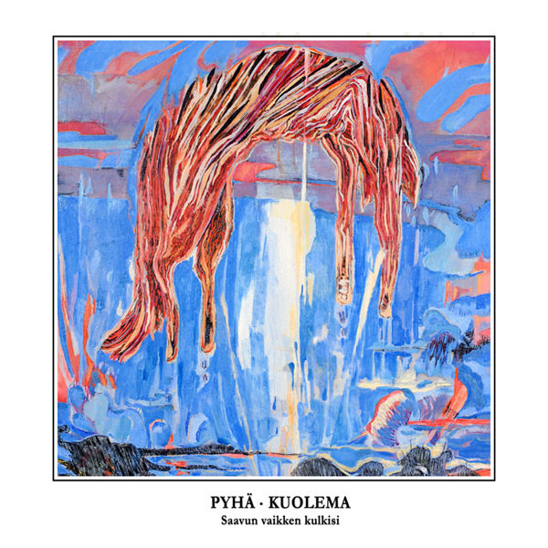

artist: **Pyhä Kuolema** release: _Saavun Vaikken Kulkisi_ format: CD year of release: 2011 label: Anima Arctica duration: 34:24

detailed info: [discogs.com](http://www.discogs.com/Pyh%C3%A4-Kuolema-Saavun-Vaikken-Kulkisi/release/3624255)

One of the latest albums on the steadily progressing **Anima Arctica** label is _Saavun Vaikken Kulkisi,_ the debut album by **Pyhä Kuolema.** A new name - meaning "holy death", if I'm not mistaken - but if I tell you that it's the solo project of **Mikko Pöyhönen** (who used to be in the duo **Tuhat Kuolemaa Sekunnissa**), that might ring some bells.

If you've heard the self-titled album _[Tuhat Kuolemaa Sekunnissa](http://www.eveningoflight.nl/2007/03/01/review-tuhat-kuolemaa-sekunnissa-2007/ "Review: Tuhat Kuolemaa Sekunnissa (2007)")_, the material on the current release will sound familiar in style, and perhaps even more stripped down. Here, Pöyhönen focuses on voice and guitar as almost the sole ingredients of his typical Finnish singer/songwriter folk. Equally or more so than on _TKS_, the vocal rhythms and melodies are tight, flowing and catchy, and herein lies the great attraction of Pyhä Kuolema's music. The diction of the Finnish language plays a major role in this, with its powerful stress pattern that is here closely linked to the accents of the music.

The twelve songs on this relatively short album are compact units, each with its own theme and merits. At the moment, I'm particularly fond of the central tracks, "Avaruusmies ja Helvetinmies" ('spaceman and damned man'?) and "Ajattele Minua" ('think of me'). Their melodies are simply lovely and stay fresh over many plays. Most likely, other tracks will rise to the occasion over later listens, as they tend to do in good albums.

It was too bad that _Tuhat Kuolemaa Sekunnissa_'s debut didn't get an official follow-up, but this one is as close as it gets. If you enjoyed Pöyhönen's earlier work this new one certainly won't disappoint you, but even if you're new to his music, _Saavun vaikken kulkisi_ is well worth getting for lovers of (neo)folk and acoustic music, particularly if you're interested in less heard languages. I'm looking forward to the next one!

Reviewed by **O.S.**

Tracklist:

1\. Linnin Laulu I (1:42) 2. Nuori Maa (3:08) 3. Tuhat Kuolemaa Sekunnissa (2:25) 4. Yöaika (3:01) 5. Pelkurin Palkka On Rakkaudettomuus (3:20) 6. Avaruusmies Ja Helvetinmies (2:35) 7. Ajattele Minua (2:21) 8. Voimamies (3:45) 9. Linnun Laulu II (2:32) 10. Syntymäpäivä (3:23) 11. Pyhän Äidin Kuolema (2:48) 12. Tanssi Vainajille (3:31)
