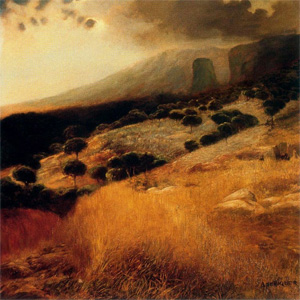

[Cloudscape #28: July 2012](http://www.mixcloud.com/eveningoflight/cloudscape-28-july-2012/?utm_source=widget&utm_medium=web&utm_campaign=base_links&utm_term=resource_link) by [Evening Of Light](http://www.mixcloud.com/eveningoflight/?utm_source=widget&utm_medium=web&utm_campaign=base_links&utm_term=profile_link) on [Mixcloud](http://www.mixcloud.com/?utm_source=widget&utm_medium=web&utm_campaign=base_links&utm_term=homepage_link)

00:00 | Lost Harbours | Hymns & Ghosts pt1 | [Hymns & Ghosts](http://www.eveningoflight.nl/2012/08/08/review-lost-harbours-hymns-ghosts-2012/ "Review: Lost Harbours – Hymns & Ghosts (2012)") | 2012 08:22 | Coil | Sex with Sun Ra (Part One - Saturnalia) | Black Antlers | 2004 17:00 | Heinali | Music to Sleep Under Snow | SEQUENCE4 | 2012 21:42 | Plinth | The London Necropolis | Collected Machine Music | 2011 23:30 | Pyhä Kuolema | Ajattele Minua | [Saavun Vaisen Kulkisi](http://www.eveningoflight.nl/2012/07/02/review-pyha-kuolema-saavun-vaikken-kulkisi-2011/ "Review: Pyhä Kuolema – Saavun Vaikken Kulkisi (2011)") | 2011 25:30 | Dag Rosenqvist & Rutger Zuydervelt | Blåsa Rök | Vintermusik | 2007 30:21 | Shrine | Lost Beauty | Somnia | 2012 35:32 | Witxes | Dead Reckoning | [Sorcery/Geography](http://www.eveningoflight.nl/2012/06/25/review-witxes-sorcerygeography-2012/ "Review: Witxes – Sorcery/Geography (2012)") | 2012 38:44 | Hakobune | I | SEQUENCE4 | 2012 46:13 | Troy Schafer | Faint Fresh Fire | [Evening Song Awaken](http://www.eveningoflight.nl/2012/03/30/review-troy-schafer-evening-song-awaken-2012/ "Review: Troy Schafer – Evening Song Awaken (2012)") | 2012 54:11 | Stone Breath | Ephrata Sacred Heart | The Silver Skein Unwound | 2003 62:11 | Martyn Bates | Gift | [Mystery Seas (Letters Written #2)](http://www.eveningoflight.nl/2007/08/07/eclipse-review-martyn-bates-mystery-seas-letters-written-2-1995/ "Eclipse Review: Martyn Bates – Mystery Seas (Letters Written #2) (1995)") | 1995
