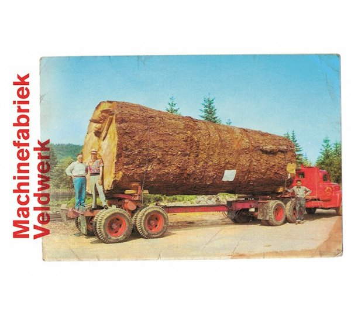

artist: **Machinefabriek** release: Veldwerk format: CD year of release: 2011 label: [Cold Spring](http://www.coldspring.co.uk/) duration: 67:22

detailed info: [discogs.com](http://www.discogs.com/Machinefabriek-Veldwerk/release/3239530)

_Veldwerk_ is a compilation of five individual works, previously released on small formats or for art installations. Though the destinations of the original recordings were somewhat disparate, the collection on one disk is suitable, and the styles of the track are compatible enough to stand together, but different enough to put a bit of excitement and tension in this album.

The ingredients are rather typical for **Rutger Zuydervelt**'s music: field recordings, lots of different sound generators and equipment, most likely, and touches of melody. "Slovensko I" couples these found sounds with some loud crashing noises and high-frequency beeps, resulting in an opening track that can be quite jarring. The long "Rusland" starts with a sparse and calm e-piano melody, slowly decaying into mellower notes, and finally a long fuzzy drone and coda of deep notes. "The Breaking Water" settles into rather gloomy dark ambient territory, with lots of deep sounds, some aqueous samples, and intense rattles that make the track pretty unsettling here and there. Similar varieties of sound are found in the latter tracks, such as the sparse ticking sounds in "Floor & Radio", and the subtle beat in "Appollo".

The very dynamic loud-soft contrasts are what make _Veldwerk_ an interesting series of tracks, but it also makes it a rather challenging album to listen to. Playing a track or two at a time and listening attentively is rewarding, but putting the whole album on in the background can be misleading. Once or twice, a sudden noise will draw your attention for a few minutes, but the quiter parts can make you forget you're really listening to something if you're not paying strict attention. My enjoyment depends on the approach of the individual moment, in other words. All the same, this album can be very rewarding both taken as a collection of separate tracks, as originally presented, or as a longer work, but mostly when you approach it consciously rather than hanging back and waiting for it to come to you.

Regardless, it's very good of **Cold Spring** to put out ambient music like this once in a while, as the subtle sounds presented here, at times calming, at times dark and uncanny, provide a good addition to an impressive label roster. Recommended for conscious electronics listeners.

reviewed by **O.S.**

Tracklist:

1\. Slovensko I (7:04) 2. Rusland (17:01) 3. The Breaking Water (9:57) 4. Floor & Radio (5:12) 5. Apollo (21:17) 6. Slovensko II (7:00)
