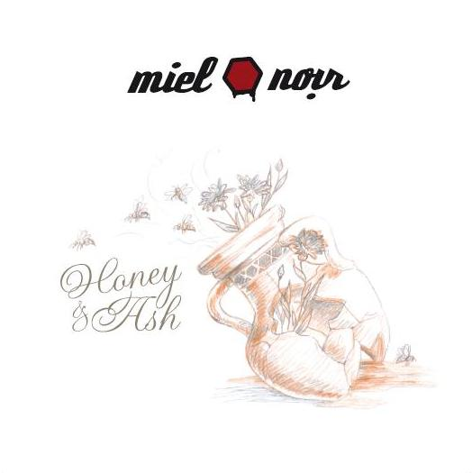

Jour Cinq

**Aspectee** - _Jour Cinq_ \[[discogs](http://www.discogs.com/Aspectee-Jour-Cinq/release/3202605)\]

Aspectee's _Jour Cinq_ is a dark ambient album by the book, with well-constructed moods and gently drifting melodies. The ten tracks on here are all around 5-6 minutes in length and flow along rather evenly, with not all that much true excitement, but quite a few good melodies to be found. A track like "Illicit" tones it down a bit, focusing on more minimal tones, whereas "Roter Wald" invests more in a gripping synth melody, so there is some variation to be found as well.

This album doesn't really stand out from the crowd that much, but if you're looking for a pleasant dark ambient trip in the direction of artists like **Kammarheit**, do give Aspectee a chance. _Jour Cinq_ was released by **Black Drone** records.

For Granted Is His Will

**Burial Hex** - _For Granted Is His Will_ \[[discogs](http://www.discogs.com/Burial-Hex-For-Granted-Is-His-Will/release/3405674)\]

This tape on Polish **Sangoplasmo** records - dedicated to **Clay Ruby**'s brother, who died as a child - is another smaller release for Burial Hex, presenting two tracks, both exploring a single idea.

The first one, "The Saintly Death", is an incredibly dark drone work based on treated metal cage sounds. Sometimes with intense reverberating clangs, sometimes subdued and ominous, this is an excellent mood piece. The second side, "Our Rainbow", is more of a raga-tinged track, with a lead role for melodica improvisations. This track has a less intimidating atmosphere, and is more free-flowing and relaxing, though never overly sweet.

All in all, these are two interesting tracks, and although Burial Hex seems to be ending as a project, these little EPs keep trickling out, proving that there is no shortage of good material in the project's latter days. Considering the trivial price of a tape this is money well spent, I'd say.

Honey & Ash

**Miel Noir** - _Honey & Ash_ \[[discogs](http://www.discogs.com/Miel-Noir-Honey-Ash/master/383725)\]

Miel Noir consists of a duo since this album: **Dimo Dimov** (**Svarrogh**) and **Marcel P.** (**Allerseelen**). The influences from their other musical activities are apparent at times on this album, but there is a very definite Miel Noir sound as well. Some of the tracks rely heavily on strong industrial beats and electronics, and some heavy guitars, while others are more calm and neoclassical. These tracks are generally my favourites, both with their own appeal.

Too bad that there are quite a few tracks on here that are average or worse in terms of composition and/or vocal performance. Particularly "In Empty Coldness" and "It's Me" are not really album material in their current state. Contrasted with a strong atmospheric piano track like "Der Feind", the inconsistency in this album becomes apparent.

A pity, because the mix of influences has a lot of potential, but in total the album is too wavering in quality for me to really enjoy as a whole. If you want to judge for yourself, seek out the CD on **Steinklang**, but I hope the next one will have a bit more quality control.
