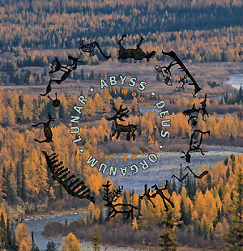

artist: **Lunar Abyss Deus Organum** release: _Atanimonni Aitnatsbus_ format: 10" year of release: 2012 label: [Substantia Innominata](http://www.dronerecords.de) duration: 23:41

detailed info: [discogs.com](http://www.discogs.com/Lunar-Abyss-Deus-Organum-Atanimonni-Aitnatsbus/release/3567822)

The latest offering on **Substantia Innominata** is an EP by **Evgeny Savenko**'s project **L.A.D.O.** On beautiful blue vinyl and in an attractive taiga cover we find almost twenty-five minutes of ambient and ethnic rituals inspired by the polar regions.

The A-side, dedicated to the element of water, is a gentle piece with a steady flow, using a murky version of **Current 93**'s "Good Morning, Great Moloch" as its melodic base. This is combined with snatches of strings, flute, chimes, and various samples. Some louder sounds disturb the peace after about 3/4 of the way, emphasising the variety and dynamics in this music, which seems at least partly improvised in its progression and layering. The end is quiet, unraveling in a locked groove of a gently flowing brook.

The flipside covers the opposing element: fire. Actual crackles and bubbles from a fire-stoked cauldron are combined with sounds from other sources that fit well with this texture. Towards the end, the track is increasingly dominated by voice and synthesizer sounds. The best part is at the end: a sample of a woman's voice singing a folksong of which I don't know the origin, but it sounds asian and/or arctic. Here too, the track fades, and we are left with a locked groove, this time the soft crackling of a fire.

Though at times the layering of the music gets a bit busy or crowded, most of the material on this track duo is very well-balanced, and presents a fascinating mishmash of folk and electronic influences. The music really breathes the elemental and ritual aspects of arctic cultures, wedded to the free vision of industrial soundscapes. This was my personal introduction to L.A.D.O.'s music, but I look forward to hearing more.

Reviewed by **O.S.**

Tracklist:

A. Atanimonni (10:31)

B. Aitnatsbus (13:10)
