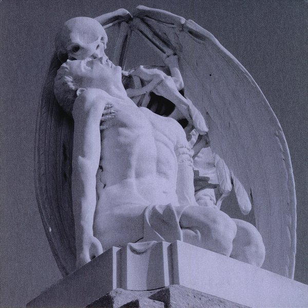

artist: **Lost Harbours** release: _Hymns & Ghosts_ format: CD year of release: 2012 label: [Liminal Noise Tapes](http://liminalnoise.blogspot.nl/) duration: 45:36

detailed info: [discogs.com](http://www.discogs.com/Lost-Harbours-Hymns-Ghosts/release/3756532)

Hello **Lost Harbours**, and welcome to that cadre of experimental folk artists that everyone worth his salt should check out. This isn't technically the debut album by the duo **Richard Thompson** and **Emma Reed**, but it is the first one released on CD in a larger run.

The setup of the album is challenging for the song-loving folkies. The listener is immediately treated to a twelve-minute droning chant piece, full of misty synth waves, voices, church bells, and the like. A lovely drifting work that places _Hymns & Ghosts_ firmly on the otherworldly side of folk music.

The four following tracks are more open and give way to Richard's guitar and voice, and Emma's woodwinds. "Spring's Fire" is still rather ghostly and ethereal, but for the two central tracks, everyone hushes. "Portent" is a stunning piece starting with delicate fingerpicked guitar, melancholy and dark. After its more intense climax, the it flows seamlessly in the sparse notes and almost whispered vocals of "Sister".

The longer "Morning Song" includes some brighter notes, but it has its darker touches too, and ample room for swirls of guitar and flute as well as calmer pieces. The album ends with the second part of the ghostly title track, another extended improvised piece, but this time with an organ base, guitar, percussion, and more layered vocals, some by **Bobbie Watson** of **Comus**.

_Hymns & Ghosts_ is an excellent album, loosely put together and giving itself free reins all the time. This results in a delightful fix of song-like parts, interludes, improvisations, and drones in a combination that makes this style of folk so appealing. I'm sure it will delight many of our readers and listeners, and I urge you to pick up this album, professionally self-released in a lovely six-panel sleeve.

Reviewed by **O.S.**

Tracklist:

1\. Hymns & Ghosts pt1 (11:43) 2. Spring's Fire (5:01) 3. Portent (4:03) 4. Sister (4:25) 5. Morning Song (8:55) 6. Hymns & Ghosts pt2 (11:29)
