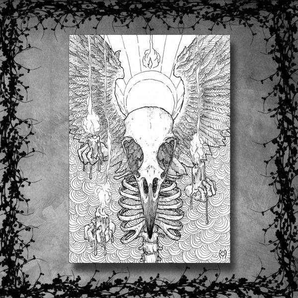

artist: **The Floating World** release: _The Apparition_ format: CD year of release: 2012 label: Cyclic Law duration: 42:46

detailed info: [discogs.com](http://www.discogs.com/Floating-World-The-Apparition/release/3454670)

If you know **The Floating World** from before, you'll remember waves of drifting flute melodies and an otherworldly, mystical atmosphere. As far as I know, there were only a handful of releases, all round 2005, on small editions. Since then, **Amanda Votta** has collaborated with **Gustaf Hildebrand** on **Lacus Somniorum**, with **Far Black Furlong** on their lovely [self-titled album](http://www.eveningoflight.nl/2008/01/01/review-far-black-furlong-far-black-furlong-haidd-2-2007/ "Review: Far Black Furlong – Far Black Furlong / Haidd 2 (2007)"), and now, finally, with a new solo album on **Cyclic Law**.

_The Apparition_ builds on Votta's dreamlike style as a flautist, but the accrued influences of the past few years are given lots of room on this new album. So much in fact, that the flute is kept to a bare minimum in the first stages of the album. Instead, the dark drones so typical of Cyclic Law music dominate for the most part. As the album develops, eerie voices, bells and melodies pierce through the thick layers of dark grey clouds.

The result is a very evocative album, at times a bit understated and drifting, that sounds quite a bit like a soundtrack to _something_, a black and white movie, a mystical painting, or even just to things that are ghostly and between worlds. Only in the last track, "If Only the Moon", does a bit of concreteness sneak in, borne by the voices of **Nicole Votta,** **Neddal Ayad** and **Timothy Renner**, in all their high-low contrast. Their lines quote Oscar Wilde's _Salomé,_ perhaps among other sources. An impressive climax.

_The Apparition_ is more in line with Cyclic Law's existing dark ambient catalogue than I had perhaps expected, but it feels like a natural development to complement the dreamy flute melodies of the older works with deeper droning undertones and hints of other instruments. It makes this album an excellent moody piece that will sit well any devotee of the label's history, though it might disappoint those possible few who expected more elaborate folk/ambient hybrids like Far Black Furlong.

Reviewed by O.S.

Tracklist:

1\. Another Way (6:04) 2. Vernal (5:38) 3. Belief In Summer (6:04) 4. Chromatic Abberation (6:07) 5. Impossible (6:04) 6. Succor (6:08) 7. If Only The Moon (6:41)
