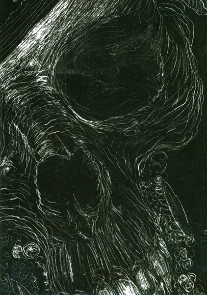

artist: **Time Moth Eye** release: _Undeath_ format: CD-R + Chapbook year of release: 2012 label: [Crucial Blaze](http://www.crucialblast.net/) duration: 64:55

detailed info: [discogs.com](http://www.discogs.com/Time-Moth-Eye-Undeath/release/3638688)

**Timothy Renner**'s output as **Stone Breath** has been quite prolific since the restart of the band a few years ago, but apparently he has found enough time away from his main musical brainchild to pursue other artistic avenues. _Undeath_ is a full-length album under the solo alias **Time Moth Eye**, and while its links with the dark folk religious themes of Stone Breath are clear, it is a thing unto itself, really.

Although many Stone Breath albums also contain tracks that are a bit more subdued, extended, and dream-like, that tendency to drone out is given centre stage on _Undeath_. The music here is very stripped down, often with single voices accompanied by single instruments. And while a string instrument pops up here and there, much of it is organ or electronic drones, manipulated voice, and the like. The Undeath theme is prominent, as is that of dreams and sleep. The entire album, in all its blacks, whites, and greys, speaks of varying states of consciousness, spirit, and breath.

Though different from the earthy tones of Stone Breath, there is something equally compelling in these tracks. There is more air, if we want to stay in elemental imagery, more cloud, but certainly not in a light way. Eschewing the generally tight boundaries of folksong, the pieces on this album stretch out and drift, profoundly moody and mystical. Renner's own deep voice is the perfect accompaniment for many of these pieces, but we hear a selection of guest voices as well, particularly in renditions of the album's central text: the Old Testament piece known as _The Valley of Dry Bones_ (Ezekiel 37).

In addition to the music, _Undeath_ boasts a 44-page chapbook with many of Renner's drawings, black-on-white and white-on-black. These too fit the themes perfectly: death, light, breath, moths, prophecies... For the price this is going at, all that is superb value for money, and if you're in any way interest in dark folk and organic drones you should seriously be looking into this release. Limited to 200 copies, so it won't last forever if there's justice in the world.

Reviewed by **O.S.**

Tracklist:

1\. Stonepusher (3:16) 2. Wake (8:49) 3. Sheetwinder (8:38) 4. Witchwalker (4:09) 5. Sleep (6:53) 6. Ossa Ossa (4:25) 7. Footsteps Fall (6:28) 8. Chrysalishroud (11:23) 9. Sleepwalker / Dreamwalker (10:55)
